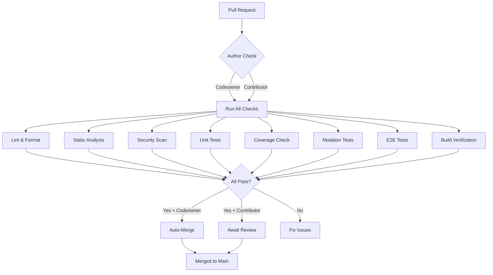

# CI/CD Pipeline Setup Guide

This document describes the world-class CI/CD pipeline for the Previewd Kubernetes operator.

## Table of Contents

- [Overview](#overview)
- [Pipeline Architecture](#pipeline-architecture)
- [Quality Gates](#quality-gates)
- [Setup Instructions](#setup-instructions)
- [Branch Protection Rules](#branch-protection-rules)
- [Auto-Merge Configuration](#auto-merge-configuration)
- [Coverage Requirements](#coverage-requirements)
- [Security Scanning](#security-scanning)
- [Troubleshooting](#troubleshooting)

## Overview

The Previewd CI/CD pipeline enforces strict quality standards:

- **100% Code Coverage**: Line, branch, and mutation coverage
- **Security First**: Multiple security scanning tools
- **Automated Quality Checks**: Linting, formatting, static analysis
- **Auto-Merge for Codeowner**: Automatic PR merges when all checks pass
- **Dependency Management**: Automated updates via Dependabot

## Pipeline Architecture



## Quality Gates

All PRs must pass these quality gates:

### 1. Code Quality

- **golangci-lint**: Comprehensive linting with 30+ linters enabled
- **gofmt**: Code formatting validation
- **goimports**: Import statement organization
- **go vet**: Go static analysis
- **staticcheck**: Advanced static analysis

### 2. Testing

- **Unit Tests**: All tests must pass
- **E2E Tests**: Full operator lifecycle tests in Kind cluster
- **Race Detection**: Tests run with `-race` flag
- **Benchmarks**: Performance regression detection

### 3. Coverage (STRICT)

- **Line Coverage**: 100% required
- **Branch Coverage**: 100% required
- **Mutation Coverage**: 100% required

### 4. Security

- **gosec**: OWASP-focused security scanner
- **govulncheck**: Go vulnerability database check
- **Nancy**: Dependency vulnerability scanner
- **Trivy**: Container image vulnerability scanner
- **CodeQL**: GitHub's semantic code analysis

### 5. Dependencies

- **License Check**: Ensures no forbidden licenses
- **Vulnerability Scan**: All dependencies scanned
- **Version Pinning**: All dependencies pinned with go.sum

### 6. Documentation

- **Markdown Link Check**: Validates all documentation links
- **README Validation**: Ensures README exists and is not empty
- **API Documentation**: Godoc validation

## Setup Instructions

### Prerequisites

1. GitHub repository created: `github.com/mikelane/previewd`
2. Repository settings access (Admin permissions)
3. GitHub CLI (`gh`) installed locally

### 1. Enable Required GitHub Features

```bash
# Enable GitHub Discussions (for community support)
gh repo edit mikelane/previewd --enable-discussions

# Enable vulnerability alerts
gh repo edit mikelane/previewd --enable-vulnerability-alerts

# Enable automated security fixes
gh repo edit mikelane/previewd --enable-automated-security-fixes
```

### 2. Set Up Codecov

**Using OIDC Authentication (Recommended - No Token Required!)**

1. Go to [codecov.io](https://codecov.io) and sign in with GitHub
2. Add the `mikelane/previewd` repository
3. That's it! OIDC authentication is already configured in the CI workflow

The workflow uses `use_oidc: true` in the Codecov upload step, which means no token is required. The GitHub Actions workflow automatically authenticates with Codecov using OpenID Connect.

### 3. Configure Branch Protection Rules

Run this command to set up branch protection for `main`:

```bash
gh api repos/mikelane/previewd/branches/main/protection \
  --method PUT \
  --input - <<EOF
{
  "required_status_checks": {
    "strict": true,
    "contexts": [
      "Lint",
      "Format Check",
      "Static Analysis",
      "Security Scan",
      "Vulnerability Scan",
      "Unit Tests",
      "Branch Coverage",
      "Mutation Testing",
      "Race Condition Detection",
      "E2E Tests",
      "Build",
      "Docker Build",
      "License Compliance",
      "Documentation Check"
    ]
  },
  "enforce_admins": false,
  "required_pull_request_reviews": {
    "dismissal_restrictions": {},
    "dismiss_stale_reviews": true,
    "require_code_owner_reviews": true,
    "required_approving_review_count": 0,
    "require_last_push_approval": false
  },
  "restrictions": null,
  "required_linear_history": true,
  "allow_force_pushes": false,
  "allow_deletions": false,
  "block_creations": false,
  "required_conversation_resolution": true,
  "lock_branch": false,
  "allow_fork_syncing": true
}
EOF
```

**Key settings:**

- **Require status checks**: All CI checks must pass
- **Require linear history**: Enforces clean git history
- **Require conversation resolution**: All PR comments must be resolved
- **Dismiss stale reviews**: Reviews are dismissed on new commits
- **Require code owner reviews**: CODEOWNERS must approve (but count is 0 for auto-merge)

### 4. Enable Auto-Merge Feature

```bash
# Enable auto-merge for the repository
gh repo edit mikelane/previewd --enable-auto-merge
```

### 5. Configure Repository Settings

```bash
# Set default branch to main
gh repo edit mikelane/previewd --default-branch main

# Disable wiki (use docs/ instead)
gh repo edit mikelane/previewd --disable-wiki

# Enable issues
gh repo edit mikelane/previewd --enable-issues

# Enable projects
gh repo edit mikelane/previewd --enable-projects

# Set merge strategies (allow squash only)
gh api repos/mikelane/previewd \
  --method PATCH \
  --field allow_squash_merge=true \
  --field allow_merge_commit=false \
  --field allow_rebase_merge=false \
  --field delete_branch_on_merge=true
```

### 6. Set Up Dependabot

Dependabot is already configured via `.github/dependabot.yml`. Verify it's enabled:

```bash
# Check Dependabot status
gh api repos/mikelane/previewd/vulnerability-alerts
```

### 7. Create Initial Milestone

```bash
# Create v0.1.0 milestone
gh api repos/mikelane/previewd/milestones \
  --method POST \
  --field title="v0.1.0" \
  --field description="Initial release - Core operator functionality" \
  --field state="open"
```

## Branch Protection Rules

The `main` branch is protected with the following rules:

- ✅ Require pull request before merging
- ✅ Require status checks to pass before merging
  - All CI checks must pass (lint, test, coverage, security, etc.)
- ✅ Require conversation resolution before merging
- ✅ Require linear history
- ✅ Require code owner review (CODEOWNERS)
- ✅ Dismiss stale reviews on new commits
- ⛔ Do not allow force pushes
- ⛔ Do not allow deletions
- ✅ Allow fork syncing
- ✅ Automatically delete head branches after merge

## Auto-Merge Configuration

### How It Works

1. **Codeowner Creates PR**: When @mikelane creates a PR, it's eligible for auto-merge
2. **All Checks Run**: The full CI pipeline executes
3. **Checks Pass**: All quality gates must pass (100% coverage, no security issues, etc.)
4. **Auto-Approval**: The auto-merge workflow approves the PR
5. **Auto-Merge**: PR is automatically squash-merged to `main`
6. **Branch Cleanup**: Feature branch is automatically deleted

### Manual Override

If you need to disable auto-merge for a specific PR:

```bash
# Disable auto-merge for a PR
gh pr merge PR_NUMBER --disable-auto
```

### Contributor PRs

PRs from external contributors:
- Run all the same checks
- Require manual review and approval from @mikelane
- Do not auto-merge (for security reasons)

## Coverage Requirements

### Line Coverage (100% Required)

All production code must be covered by tests. To check locally:

```bash
make cover
```

This generates:
- `coverage.out`: Coverage data
- `coverage.html`: HTML report (open in browser)

### Branch Coverage (100% Required)

Go's atomic coverage mode tracks branch coverage. The CI enforces 100% branch coverage.

### Mutation Coverage (100% Required)

Mutation testing ensures tests actually validate behavior, not just execute code.

**What is Mutation Testing?**

Mutation testing modifies your code (introduces bugs) and verifies that tests catch the bugs. If tests still pass after introducing a bug, the mutation "survives" - indicating weak tests.

**Tools Used:**

- `go-mutesting`: Mutation testing for Go

**Running Locally:**

```bash
# Install go-mutesting
go install github.com/zimmski/go-mutesting/cmd/go-mutesting@latest

# Run mutation tests on a package
go-mutesting ./controllers
```

**Example:**

Original code:
```go
if x > 10 {
    return true
}
return false
```

Mutation:
```go
if x >= 10 {  // Changed > to >=
    return true
}
return false
```

If your tests still pass with this mutation, you're missing a test case for `x = 10`.

### Coverage Exceptions

The following are excluded from coverage requirements:

- Generated code (`zz_generated.*.go`)
- Test files (`*_test.go`)
- Test utilities (`test/` directory)
- Build scripts (`hack/` directory)

## Security Scanning

### gosec - Go Security Scanner

Scans for common security issues:

- SQL injection
- Command injection
- Weak random number generation
- Hardcoded credentials
- And 60+ other checks

### govulncheck - Vulnerability Database

Checks for known vulnerabilities in:
- Direct dependencies
- Transitive dependencies
- Standard library

### Nancy - Sonatype OSS Index

Additional dependency vulnerability scanning using Sonatype's database.

### Trivy - Container Scanner

Scans Docker images for:
- OS package vulnerabilities
- Application dependency vulnerabilities
- Configuration issues
- Secrets in images

### CodeQL - Semantic Analysis

GitHub's advanced semantic code analysis for:
- Security vulnerabilities
- Code quality issues
- Common bug patterns

## Troubleshooting

### Coverage Not 100%

**Problem**: Coverage check fails

**Solution**:

1. Run coverage locally:
   ```bash
   make cover
   ```

2. Open `coverage.html` in browser to see uncovered lines

3. Add tests for uncovered code

4. If code is intentionally untestable, move it to an excluded directory or add a `//nolint:coverage` comment (sparingly!)

### Mutation Tests Failing

**Problem**: Mutation score below 100%

**Solution**:

1. Run mutation tests locally:
   ```bash
   go-mutesting ./path/to/package
   ```

2. Review surviving mutations

3. Add tests that would catch those mutations

4. Common issues:
   - Missing boundary tests (`>` vs `>=`)
   - Missing error case tests
   - Missing nil checks
   - Incomplete assertion coverage

### Auto-Merge Not Working

**Problem**: PR not auto-merging even though all checks pass

**Debugging**:

1. Check if auto-merge is enabled:
   ```bash
   gh pr view PR_NUMBER --json autoMergeRequest
   ```

2. Verify you're the codeowner:
   ```bash
   gh api repos/mikelane/previewd/codeowners/errors
   ```

3. Check workflow run logs:
   ```bash
   gh run list --workflow=auto-merge.yml
   gh run view RUN_ID --log
   ```

4. Ensure branch protection allows auto-merge (required_approving_review_count should be 0 or 1)

### Security Scan False Positives

**Problem**: gosec flags safe code as vulnerable

**Solution**:

1. Review the finding carefully (it may be a real issue!)

2. If it's truly a false positive, add a `//nolint:gosec` comment with explanation:
   ```go
   // Using math/rand for non-cryptographic random selection
   //nolint:gosec // G404: This is not cryptographic use
   n := rand.Intn(100)
   ```

3. Update `.golangci.yml` to exclude specific gosec rules if needed (but be cautious!)

### Workflow Permission Errors

**Problem**: GitHub Actions can't write to PR or create comments

**Solution**:

1. Check repository settings → Actions → General → Workflow permissions
2. Set to "Read and write permissions"
3. Enable "Allow GitHub Actions to create and approve pull requests"

```bash
# Via API
gh api repos/mikelane/previewd \
  --method PATCH \
  --field default_workflow_permissions="write" \
  --field can_approve_pull_request_reviews=true
```

## Workflow Files Reference

All workflow files are in `.github/workflows/`:

- **ci.yml**: Main CI pipeline (all quality checks)
- **auto-merge.yml**: Auto-merge for codeowner PRs
- **test.yml**: Basic unit tests (kept for compatibility)
- **lint.yml**: Basic linting (kept for compatibility)
- **test-e2e.yml**: E2E tests (kept for compatibility)

The main `ci.yml` workflow is comprehensive and includes all checks. The individual workflows (`test.yml`, `lint.yml`, `test-e2e.yml`) are kept for backward compatibility and can be removed once the main CI pipeline is stable.

## Best Practices

### For Mike (Codeowner)

1. **Trust the Pipeline**: If all checks pass, the code is good to merge
2. **Review Failing Checks**: Don't override failures without understanding the root cause
3. **Keep Coverage at 100%**: No exceptions (except explicitly excluded code)
4. **Fix Security Issues**: Never ignore security scanner findings
5. **Update Dependencies**: Review and merge Dependabot PRs promptly

### For Contributors

1. **Run Quality Checks Locally**: Use `make quality` before pushing
2. **Write Comprehensive Tests**: Aim for 100% coverage from the start
3. **Follow TDD**: Write tests before code
4. **Document Changes**: Update relevant documentation in the same PR
5. **Keep PRs Focused**: One feature/fix per PR for easier review

## Metrics and Monitoring

### CI Pipeline Performance

Track these metrics:

- **Pipeline Duration**: Target < 10 minutes for full pipeline
- **Flaky Tests**: Should be 0%
- **Coverage Trend**: Should stay at 100%
- **Security Findings**: Track and trend over time
- **Dependency Freshness**: Track time to merge Dependabot PRs

### Quality Metrics

- **Test Count**: Track as codebase grows
- **Mutation Score**: Must remain 100%
- **Linter Warnings**: Should be 0
- **Security Vulnerabilities**: Should be 0

## Future Enhancements

Planned improvements:

- [ ] CodeCov OIDC authentication (when available)
- [ ] Performance benchmarking with historical comparison
- [ ] Automated canary deployments
- [ ] Slack/Discord notifications for CI failures
- [ ] Automated changelog generation
- [ ] Release automation
- [ ] Signed commits verification
- [ ] SLSA provenance for releases

## Support

If you encounter issues with the CI/CD pipeline:

1. Check this documentation
2. Review workflow run logs: `gh run list`
3. Open an issue: `gh issue create`
4. Contact @mikelane

## References

- [GitHub Actions Documentation](https://docs.github.com/en/actions)
- [Codecov Documentation](https://docs.codecov.com/)
- [golangci-lint Documentation](https://golangci-lint.run/)
- [Mutation Testing Concepts](https://en.wikipedia.org/wiki/Mutation_testing)
- [OWASP Top 10](https://owasp.org/www-project-top-ten/)
