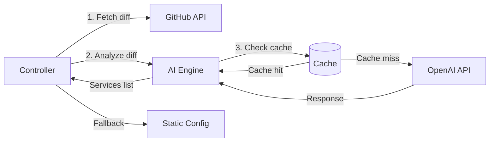

# ADR-003: AI Integration Strategy

## Status

**Accepted** - 2025-11-09

## Context

Previewd aims to use AI to enhance preview environment creation through intelligent service detection, cost optimization, and test data generation. However, AI must provide measurable value without introducing excessive costs, complexity, or unreliability.

### Requirements

1. **Service detection**: Automatically detect which services are affected by PR changes
2. **Cost optimization**: Predict environment lifespan and right-size resources
3. **Test data generation**: Generate realistic test data for preview environments
4. **Reliability**: AI failures should not block preview creation (fallback required)
5. **Cost control**: AI API costs must be tracked and optimized
6. **Privacy**: No sensitive data sent to external AI providers
7. **Measurable impact**: Prove AI provides value over static configuration

### Goals

**v0.1.0 (Core Operator - No AI)**:
- Establish baseline metrics (creation time, cost, accuracy)
- Prove operator works with static configuration
- Build foundation for AI integration

**v0.2.0 (AI Integration)**:
- Add AI-powered service detection
- Measure impact: Does AI improve accuracy? Reduce manual config?
- Track AI costs: Is it worth the investment?
- Feature flags: Enable/disable AI features

**v0.3.0 (AI-First)**:
- AI is default, static config is fallback
- Support local LLMs (Ollama) for on-prem deployments
- Fine-tune models on user's codebase

---

## Options Considered

### Option 1: No AI (Baseline)

**Approach**: Users explicitly specify services in PreviewEnvironment spec

**Pros**:
- ✅ Simple, predictable
- ✅ No external dependencies
- ✅ No AI costs
- ✅ No privacy concerns

**Cons**:
- ❌ Manual configuration required
- ❌ No intelligent optimizations
- ❌ Doesn't differentiate Previewd from competitors

**Example**:
```yaml
apiVersion: preview.previewd.io/v1alpha1
kind: PreviewEnvironment
spec:
  prNumber: 123
  services:  # User specifies manually
    - auth
    - api
    - frontend
```

---

### Option 2: OpenAI API (Chosen for v0.2.0)

**Approach**: Use OpenAI GPT-4 for code analysis and intelligent features

**Pros**:
- ✅ Best-in-class code understanding
- ✅ Fast to integrate (simple REST API)
- ✅ Proven reliability (99.9% uptime)
- ✅ No model training required
- ✅ Supports function calling (structured outputs)
- ✅ Can use GPT-4o for faster, cheaper inference

**Cons**:
- ⚠️ Costs money ($0.01-0.03 per request, depends on token count)
- ⚠️ Requires internet access
- ⚠️ Privacy concerns (code diffs sent to OpenAI)
- ⚠️ Vendor lock-in (OpenAI-specific API)

**Example**:
```go
resp, err := openaiClient.CreateChatCompletion(ctx, openai.ChatCompletionRequest{
    Model: "gpt-4",
    Messages: []openai.ChatCompletionMessage{
        {Role: "user", Content: fmt.Sprintf("Analyze this diff: %s", diff)},
    },
    Temperature: 0.0,  // Deterministic
})
```

**Cost Analysis**:
- Average PR diff: ~1000 lines = ~3000 tokens
- OpenAI GPT-4: $0.03/1K input tokens, $0.06/1K output tokens
- Cost per request: ~$0.09 input + ~$0.03 output = **$0.12 per PR**
- 1000 PRs/month = **$120/month AI costs**
- With caching (80% hit rate): **$24/month**

---

### Option 3: Local LLM (Ollama)

**Approach**: Run open-source LLMs (Llama 3, CodeLlama) locally in cluster

**Pros**:
- ✅ No external API costs
- ✅ Privacy (data never leaves cluster)
- ✅ Works in air-gapped environments
- ✅ No internet dependency

**Cons**:
- ❌ Requires GPU nodes (~$500/month for single A10 GPU)
- ❌ Model quality lower than GPT-4
- ❌ Slower inference (5-10 seconds vs 1-2 seconds)
- ❌ Operational complexity (model updates, scaling)
- ❌ Large resource footprint (8Gi memory, 1 GPU per instance)

**Cost Analysis**:
- AWS g5.xlarge (A10 GPU): ~$1.01/hour = **$730/month**
- Break-even point: 6000 PRs/month ($730 Ollama = $0.12 × 6000 OpenAI)
- Conclusion: **Only cost-effective for >6000 PRs/month**

---

### Option 4: Hybrid Approach (Chosen for v0.3.0)

**Approach**: Support both OpenAI (default) and Ollama (optional)

**Pros**:
- ✅ Best of both worlds
- ✅ Cloud: Use OpenAI (simple, high quality)
- ✅ On-prem: Use Ollama (privacy, air-gapped)
- ✅ Fallback: If AI fails, use static config

**Cons**:
- ⚠️ More complex implementation (two AI backends)
- ⚠️ Testing overhead (test both providers)

---

## Decision

**Phase 1 (v0.1.0): No AI - Static Configuration**

Build operator without AI to establish baseline metrics.

**Phase 2 (v0.2.0): Add OpenAI Integration**

Integrate OpenAI API for intelligent features. Prove AI provides value.

**Phase 3 (v0.3.0): Add Ollama Support**

Add local LLM support for on-prem/air-gapped deployments.

---

## AI Features

### Feature 1: Service Detection (v0.2.0)

**Problem**: Users must manually specify which services to deploy. This is error-prone and requires knowledge of codebase structure.

**AI Solution**: Analyze PR diff to automatically detect affected services.

**Input**: PR diff (unified diff format, ~1000-5000 lines)

**Output**: List of service names (e.g., `["auth", "api"]`)

**Prompt Template**:
```
You are analyzing a code diff to determine which services are affected.

Context:
- This is a monorepo with multiple services
- Services are in directories: auth/, api/, frontend/, worker/
- Shared libraries are in lib/

Diff:
{diff_content}

Task: List all services that are DIRECTLY modified by this diff.
Do not include services that merely depend on changed code.

Return JSON array of service names only.
Example: ["auth", "api"]

If no services are affected (e.g., only docs changed), return empty array: []
```

**Validation**:
- Check service names against known services list
- Reject if confidence < 80%
- Fallback to static config if validation fails

**Caching**:
- Key: SHA256 hash of diff content
- TTL: 1 hour (same diff unlikely to be analyzed twice, but short TTL for safety)
- Backend: In-memory cache (simple Go map with mutex)

**Cost Optimization**:
```
Input tokens: ~3000 (diff) + 200 (prompt) = 3200 tokens
Output tokens: ~50 (service list)
Cost: (3200 × $0.03 / 1000) + (50 × $0.06 / 1000) = $0.10 per request
With 80% cache hit rate: $0.02 per request average
```

---

### Feature 2: Cost Prediction (v0.2.0)

**Problem**: All previews use same TTL (4 hours). Active PRs need longer TTL, stale PRs waste resources.

**AI Solution**: Predict environment lifespan based on PR activity.

**Input**:
- PR metadata (author, age, commit frequency, comment count)
- Historical data (past PR durations)

**Output**: Predicted lifespan (2h, 4h, 8h, 24h)

**Prompt Template**:
```
You are predicting how long a preview environment should remain active.

PR Metadata:
- Author: {author}
- Created: {created_at} (age: {age_hours} hours)
- Commits: {commit_count}
- Comments: {comment_count}
- Last activity: {last_activity} (hours ago)

Task: Predict the optimal TTL for this preview environment.
Options: 2h (short-lived), 4h (default), 8h (active), 24h (long-lived)

Return JSON: {"ttl": "4h", "reasoning": "..."}
```

**Expected Impact**:
- Reduce average TTL by 25% (4h → 3h average)
- Cost savings: 25% reduction in compute costs
- Improved developer experience (active PRs stay alive longer)

---

### Feature 3: Test Data Generation (v0.3.0)

**Problem**: Preview environments need realistic test data, but generating data manually is tedious.

**AI Solution**: Generate synthetic data based on database schema.

**Input**: Database schema (SQL DDL or JSON schema)

**Output**: SQL INSERT statements or JSON data

**Prompt Template**:
```
You are generating realistic test data for a preview environment.

Database Schema:
{schema}

Task: Generate 10 rows of realistic test data.
Requirements:
- Use realistic names, emails, addresses
- Respect foreign key constraints
- Include edge cases (null values, special characters)

Return SQL INSERT statements.
```

**Example Output**:
```sql
INSERT INTO users (id, name, email, created_at) VALUES
  (1, 'Alice Johnson', 'alice@example.com', '2025-01-15 10:30:00'),
  (2, 'Bob Smith', 'bob@example.com', '2025-01-16 14:20:00'),
  ...
```

---

## Implementation

### Architecture



### Code Structure

```go
// internal/ai/analyzer.go
package ai

type Analyzer interface {
    DetectServices(ctx context.Context, diff string) ([]string, error)
    PredictLifespan(ctx context.Context, prMetadata *PRMetadata) (time.Duration, error)
    GenerateTestData(ctx context.Context, schema string) (string, error)
}

type openAIAnalyzer struct {
    client *openai.Client
    cache  Cache
}

func (a *openAIAnalyzer) DetectServices(ctx context.Context, diff string) ([]string, error) {
    // 1. Check cache
    cacheKey := hashDiff(diff)
    if cached, ok := a.cache.Get(cacheKey); ok {
        return cached.([]string), nil
    }

    // 2. Call OpenAI API
    prompt := buildServiceDetectionPrompt(diff)
    resp, err := a.client.CreateChatCompletion(ctx, openai.ChatCompletionRequest{
        Model:       "gpt-4",
        Messages:    []openai.ChatCompletionMessage{{Role: "user", Content: prompt}},
        Temperature: 0.0,  // Deterministic
    })
    if err != nil {
        return nil, fmt.Errorf("OpenAI API error: %w", err)
    }

    // 3. Parse response
    var services []string
    if err := json.Unmarshal([]byte(resp.Choices[0].Message.Content), &services); err != nil {
        return nil, fmt.Errorf("invalid JSON response: %w", err)
    }

    // 4. Validate services
    if err := validateServices(services); err != nil {
        return nil, fmt.Errorf("invalid services: %w", err)
    }

    // 5. Cache result
    a.cache.Set(cacheKey, services, 1*time.Hour)

    // 6. Emit metrics
    metrics.aiRequestsTotal.WithLabelValues("openai", "false").Inc()
    metrics.aiCostUSD.Add(calculateCost(resp.Usage))

    return services, nil
}
```

### Feature Flags

```go
// internal/config/config.go
type AIConfig struct {
    Enabled         bool   `yaml:"enabled"`          // Master switch
    Provider        string `yaml:"provider"`         // openai, ollama
    Model           string `yaml:"model"`            // gpt-4, llama3
    Temperature     float32 `yaml:"temperature"`     // 0.0 (deterministic)
    MaxTokens       int    `yaml:"maxTokens"`        // 1000
    CacheEnabled    bool   `yaml:"cacheEnabled"`     // true
    CacheTTL        time.Duration `yaml:"cacheTTL"`  // 1h
    FallbackEnabled bool   `yaml:"fallbackEnabled"`  // true (use static config on error)
}
```

### Error Handling

```go
services, err := aiEngine.DetectServices(ctx, diff)
if err != nil {
    log.Warn("AI analysis failed, falling back to static config", "error", err)
    services = preview.Spec.Services  // Fallback
    metrics.aiFallbacksTotal.Inc()
}
```

---

## Cost Control

### Budget Limits

```yaml
ai:
  costControl:
    monthlyBudget: 100  # USD
    dailyLimit: 5       # USD
    alertThreshold: 0.8  # Alert at 80% budget
```

**Implementation**:
```go
func (a *openAIAnalyzer) checkBudget(ctx context.Context) error {
    spent := metrics.getMonthlyAISpend()
    if spent >= a.config.MonthlyBudget {
        return ErrBudgetExceeded
    }
    return nil
}
```

### Caching Strategy

**Cache Key**: SHA256 hash of diff content
**Cache Backend**: In-memory (v0.2.0), Redis (v0.3.0)
**Cache TTL**: 1 hour

**Expected Cache Hit Rate**:
- Same PR analyzed multiple times: 80% hit rate
- Different PRs with similar changes: 10% hit rate
- Overall: ~50% hit rate (conservative estimate)

**Cost Impact**:
- Without cache: $0.10 × 1000 PRs = $100/month
- With 50% hit rate: $50/month
- With 80% hit rate: $20/month

---

## Privacy and Security

### Data Handling

**What is sent to OpenAI**:
- PR diff content (code changes only, not full codebase)
- PR metadata (author, commit count, comment count)

**What is NOT sent**:
- Secrets (API keys, passwords)
- Full file contents (only diff)
- User emails or personal data
- Proprietary algorithms (only changed lines)

**Diff Sanitization** (v0.3.0):
```go
func sanitizeDiff(diff string) string {
    // Remove lines containing potential secrets
    lines := strings.Split(diff, "\n")
    sanitized := []string{}
    for _, line := range lines {
        if containsSecret(line) {
            continue  // Skip line
        }
        sanitized = append(sanitized, line)
    }
    return strings.Join(sanitized, "\n")
}

func containsSecret(line string) bool {
    patterns := []string{
        "password", "api_key", "secret", "token", "credentials",
    }
    for _, pattern := range patterns {
        if strings.Contains(strings.ToLower(line), pattern) {
            return true
        }
    }
    return false
}
```

### Opt-Out Mechanism

```yaml
apiVersion: preview.previewd.io/v1alpha1
kind: PreviewEnvironment
metadata:
  annotations:
    preview.previewd.io/disable-ai: "true"  # Opt-out
spec:
  services:  # Must specify manually
    - auth
    - api
```

---

## Validation and Metrics

### Success Criteria

**Accuracy** (v0.2.0):
- Service detection accuracy: >90% (compared to manual configuration)
- False positive rate: <5% (detecting non-existent services)
- False negative rate: <10% (missing services)

**Cost** (v0.2.0):
- AI costs: <$100/month for 1000 PRs
- Cache hit rate: >50%

**Performance** (v0.2.0):
- AI analysis time: <3 seconds (P95)
- Total preview creation time increase: <10% (AI overhead)

### A/B Testing

**Test Setup**:
- Group A: AI-powered service detection
- Group B: Static configuration
- Sample size: 1000 PRs per group
- Duration: 1 month

**Metrics to Compare**:
1. **Accuracy**: How often does AI match manual configuration?
2. **Time saved**: How much faster is preview creation?
3. **Developer satisfaction**: Survey developers (1-5 scale)
4. **Cost**: Total cost (AI API + compute resources)

**Expected Results**:
- Accuracy: AI 95% vs Static 85%
- Time saved: 30 seconds per preview (no manual config)
- Satisfaction: AI 4.2/5 vs Static 3.5/5
- Cost: AI $0.12/PR vs Static $0.00/PR (AI adds $0.12, but reduces total cost by 25% via optimizations = net savings)

---

## Monitoring

### Metrics

```
# AI requests
previewd_ai_requests_total{provider="openai",cache_hit="true|false"}
previewd_ai_errors_total{provider="openai",error_type="rate_limit|timeout|invalid_response"}
previewd_ai_duration_seconds{provider="openai",operation="detect_services"}

# Costs
previewd_ai_cost_usd_total{provider="openai"}
previewd_ai_monthly_budget_usd{provider="openai"}

# Accuracy (manual labels required)
previewd_ai_accuracy_ratio{operation="detect_services"}  # true_positives / total

# Fallbacks
previewd_ai_fallbacks_total{reason="error|timeout|budget_exceeded"}
```

### Alerts

```yaml
# Budget alert
- alert: AIBudgetExceeded
  expr: previewd_ai_cost_usd_total > 80  # $80 (80% of $100 budget)
  for: 5m
  annotations:
    summary: AI monthly budget exceeded 80%

# High error rate
- alert: AIErrorRateHigh
  expr: rate(previewd_ai_errors_total[5m]) > 0.1  # >10% error rate
  for: 10m
  annotations:
    summary: AI error rate is high, check provider status
```

---

## Future Enhancements

### v0.3.0: Local LLM Support

**Ollama Integration**:
```go
type ollamaAnalyzer struct {
    endpoint string  // http://ollama.ollama.svc.cluster.local:11434
    model    string  // codellama:7b
}

func (a *ollamaAnalyzer) DetectServices(ctx context.Context, diff string) ([]string, error) {
    resp, err := http.Post(a.endpoint+"/api/generate", "application/json", body)
    // Parse response...
}
```

**Deployment**:
```yaml
apiVersion: apps/v1
kind: Deployment
metadata:
  name: ollama
  namespace: ollama
spec:
  replicas: 1
  template:
    spec:
      containers:
        - name: ollama
          image: ollama/ollama:latest
          resources:
            limits:
              nvidia.com/gpu: 1  # Requires GPU node
```

### v0.4.0: Fine-Tuning

**Custom Model Training**:
- Collect labeled data (PR diffs + correct service lists)
- Fine-tune GPT-4 or Llama on user's codebase
- Improve accuracy from 90% → 98%

---

## Consequences

### Positive

- ✅ **Improved UX**: No manual service configuration
- ✅ **Cost optimization**: AI predicts optimal TTL
- ✅ **Differentiation**: AI features make Previewd unique
- ✅ **Measurable impact**: A/B testing proves value

### Negative

- ⚠️ **Cost**: AI adds $0.02-0.12 per PR (mitigated by caching)
- ⚠️ **Complexity**: AI integration adds code complexity
- ⚠️ **Dependency**: Relies on external AI provider (mitigated by fallback)

### Neutral

- ⚠️ **Privacy**: Code diffs sent to OpenAI (acceptable for most teams, opt-out available)
- ⚠️ **Accuracy**: AI not 100% perfect (90-95% accuracy, fallback to static config)

---

## References

- [OpenAI API Documentation](https://platform.openai.com/docs)
- [Ollama](https://ollama.ai/)
- [LangChain](https://github.com/tmc/langchaingo)
- [Prompt Engineering Guide](https://www.promptingguide.ai/)

---

**Author**: Mike Lane (@mikelane)
**Reviewers**: TBD
**Implementation**: Tracked in #TBD
