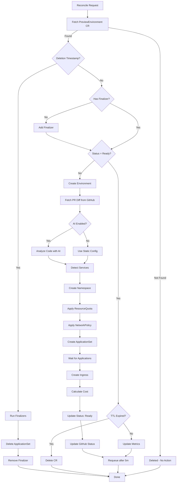
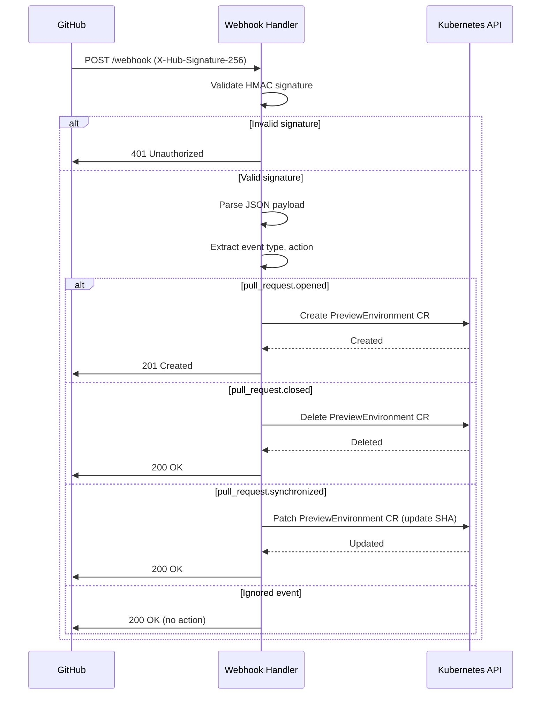

# Component Design

## Overview

This document details the internal architecture of Previewd's components, their responsibilities, interfaces, and interactions. Each component is designed to be testable, maintainable, and follows Go and Kubernetes best practices.

## Package Structure

```
previewd/
├── cmd/
│   └── main.go                           # Entrypoint, setup, signal handling
├── api/v1alpha1/
│   ├── previewenvironment_types.go       # CRD types
│   ├── groupversion_info.go             # API group metadata
│   └── zz_generated.deepcopy.go         # Generated (controller-gen)
├── internal/
│   ├── controller/
│   │   ├── previewenvironment_controller.go  # Main reconciler
│   │   ├── previewenvironment_controller_test.go
│   │   └── suite_test.go                # envtest setup
│   ├── webhook/
│   │   ├── server.go                    # HTTP server setup
│   │   ├── github_handler.go            # GitHub webhook handler
│   │   ├── github_handler_test.go
│   │   └── signature.go                 # HMAC validation
│   ├── github/
│   │   ├── client.go                    # GitHub API client interface
│   │   ├── client_impl.go               # go-github wrapper
│   │   ├── diff.go                      # PR diff fetching
│   │   ├── status.go                    # Commit status updates
│   │   └── mock_client.go               # Mock for testing
│   ├── argocd/
│   │   ├── applicationset.go            # ApplicationSet CRUD
│   │   ├── applicationset_builder.go    # Builder pattern
│   │   └── applicationset_test.go
│   ├── ai/                              # v0.2.0+
│   │   ├── analyzer.go                  # Code analysis interface
│   │   ├── openai_analyzer.go           # OpenAI implementation
│   │   ├── cache.go                     # Response caching
│   │   ├── cache_test.go
│   │   └── mock_analyzer.go             # Mock for testing
│   ├── cost/
│   │   ├── estimator.go                 # Cost calculation
│   │   ├── estimator_test.go
│   │   └── types.go                     # Cost data structures
│   ├── cleanup/
│   │   ├── scheduler.go                 # TTL enforcement
│   │   ├── scheduler_test.go
│   │   └── predicates.go                # Cleanup predicates
│   └── config/
│       ├── config.go                    # Operator configuration
│       └── defaults.go                  # Default values
├── pkg/                                  # Public APIs (if needed)
└── test/
    ├── e2e/
    │   ├── suite_test.go
    │   └── previewenvironment_test.go
    └── utils/
        ├── kind.go                      # kind cluster helpers
        └── fixtures.go                  # Test data builders
```

## Component Details

---

## 1. Main Entrypoint (`cmd/main.go`)

### Responsibility
- Application bootstrapping
- Configuration loading
- Signal handling (graceful shutdown)
- Metrics server setup
- Health check endpoints

### Implementation

```go
package main

import (
    "flag"
    "os"

    "k8s.io/apimachinery/pkg/runtime"
    ctrl "sigs.k8s.io/controller-runtime"
    "sigs.k8s.io/controller-runtime/pkg/healthz"
    "sigs.k8s.io/controller-runtime/pkg/log/zap"
    metricsserver "sigs.k8s.io/controller-runtime/pkg/metrics/server"

    previewv1alpha1 "github.com/mikelane/previewd/api/v1alpha1"
    "github.com/mikelane/previewd/internal/controller"
    "github.com/mikelane/previewd/internal/webhook"
)

func main() {
    var metricsAddr string
    var enableLeaderElection bool
    var webhookAddr string
    var webhookPort int

    flag.StringVar(&metricsAddr, "metrics-bind-address", ":8080", "Metrics server address")
    flag.StringVar(&webhookAddr, "webhook-bind-address", "0.0.0.0", "Webhook server address")
    flag.IntVar(&webhookPort, "webhook-port", 9443, "Webhook server port")
    flag.BoolVar(&enableLeaderElection, "leader-elect", false, "Enable leader election")

    opts := zap.Options{Development: true}
    opts.BindFlags(flag.CommandLine)
    flag.Parse()

    ctrl.SetLogger(zap.New(zap.UseFlagOptions(&opts)))
    setupLog := ctrl.Log.WithName("setup")

    // Create manager
    mgr, err := ctrl.NewManager(ctrl.GetConfigOrDie(), ctrl.Options{
        Scheme: scheme,
        Metrics: metricsserver.Options{BindAddress: metricsAddr},
        HealthProbeBindAddress: ":8081",
        LeaderElection: enableLeaderElection,
        LeaderElectionID: "previewd.preview.io",
    })
    if err != nil {
        setupLog.Error(err, "unable to create manager")
        os.Exit(1)
    }

    // Setup controller
    if err = (&controller.PreviewEnvironmentReconciler{
        Client: mgr.GetClient(),
        Scheme: mgr.GetScheme(),
    }).SetupWithManager(mgr); err != nil {
        setupLog.Error(err, "unable to create controller")
        os.Exit(1)
    }

    // Setup health checks
    if err := mgr.AddHealthzCheck("healthz", healthz.Ping); err != nil {
        setupLog.Error(err, "unable to set up health check")
        os.Exit(1)
    }
    if err := mgr.AddReadyzCheck("readyz", healthz.Ping); err != nil {
        setupLog.Error(err, "unable to set up ready check")
        os.Exit(1)
    }

    // Start webhook server (in goroutine)
    go func() {
        webhookServer := webhook.NewServer(webhookAddr, webhookPort, mgr.GetClient())
        if err := webhookServer.Start(); err != nil {
            setupLog.Error(err, "unable to start webhook server")
            os.Exit(1)
        }
    }()

    // Start manager (blocks until SIGTERM)
    setupLog.Info("starting manager")
    if err := mgr.Start(ctrl.SetupSignalHandler()); err != nil {
        setupLog.Error(err, "problem running manager")
        os.Exit(1)
    }
}
```

**Key Decisions**:
- Uses controller-runtime for manager setup
- Leader election disabled by default (single replica)
- Webhook server runs in separate goroutine
- Graceful shutdown via signal handling

---

## 2. PreviewEnvironment Controller (`internal/controller/`)

### Responsibility
- Reconcile PreviewEnvironment custom resources
- Create/update/delete preview environments
- Update status conditions and metrics
- Integrate with GitHub, ArgoCD, AI engine

### Interface

```go
type PreviewEnvironmentReconciler struct {
    client.Client
    Scheme *runtime.Scheme

    // Dependencies (injected for testing)
    GitHubClient    github.Client
    ArgoCDManager   argocd.Manager
    AIAnalyzer      ai.Analyzer        // v0.2.0+
    CostEstimator   cost.Estimator
}

// Reconcile implements the reconciliation loop
func (r *PreviewEnvironmentReconciler) Reconcile(ctx context.Context, req ctrl.Request) (ctrl.Result, error)

// SetupWithManager registers the controller with the manager
func (r *PreviewEnvironmentReconciler) SetupWithManager(mgr ctrl.Manager) error
```

### Reconciliation Logic



### Implementation Skeleton

```go
func (r *PreviewEnvironmentReconciler) Reconcile(ctx context.Context, req ctrl.Request) (ctrl.Result, error) {
    log := ctrl.LoggerFrom(ctx)

    // 1. Fetch PreviewEnvironment
    var preview previewv1alpha1.PreviewEnvironment
    if err := r.Get(ctx, req.NamespacedName, &preview); err != nil {
        if apierrors.IsNotFound(err) {
            return ctrl.Result{}, nil  // Deleted, nothing to do
        }
        return ctrl.Result{}, err
    }

    // 2. Handle deletion (finalizers)
    if !preview.ObjectMeta.DeletionTimestamp.IsZero() {
        return r.reconcileDelete(ctx, &preview)
    }

    // 3. Add finalizer if missing
    if !controllerutil.ContainsFinalizer(&preview, finalizerName) {
        controllerutil.AddFinalizer(&preview, finalizerName)
        if err := r.Update(ctx, &preview); err != nil {
            return ctrl.Result{}, err
        }
    }

    // 4. Reconcile environment
    if !r.isReady(&preview) {
        return r.reconcileCreate(ctx, &preview)
    }

    // 5. Check TTL
    if r.isTTLExpired(&preview) {
        log.Info("TTL expired, deleting environment")
        if err := r.Delete(ctx, &preview); err != nil {
            return ctrl.Result{}, err
        }
        return ctrl.Result{}, nil
    }

    // 6. Update metrics and requeue
    r.updateMetrics(&preview)
    return ctrl.Result{RequeueAfter: 5 * time.Minute}, nil
}

func (r *PreviewEnvironmentReconciler) reconcileCreate(ctx context.Context, preview *previewv1alpha1.PreviewEnvironment) (ctrl.Result, error) {
    log := ctrl.LoggerFrom(ctx)

    // Update status: Creating
    preview.Status.Conditions = []metav1.Condition{
        {Type: "Deploying", Status: metav1.ConditionTrue, Reason: "Creating"},
    }
    if err := r.Status().Update(ctx, preview); err != nil {
        return ctrl.Result{}, err
    }

    // Fetch PR diff
    diff, err := r.GitHubClient.FetchDiff(ctx, preview.Spec.Repository, preview.Spec.PRNumber)
    if err != nil {
        log.Error(err, "failed to fetch PR diff")
        return ctrl.Result{}, err
    }

    // Analyze code (AI or static)
    var services []string
    if r.AIAnalyzer != nil {
        services, err = r.AIAnalyzer.DetectServices(ctx, diff)
        if err != nil {
            log.Error(err, "AI analysis failed, falling back to static config")
            services = preview.Spec.Services  // Fallback
        }
    } else {
        services = preview.Spec.Services  // Static config
    }

    // Create namespace
    ns := r.buildNamespace(preview)
    if err := r.Create(ctx, ns); err != nil && !apierrors.IsAlreadyExists(err) {
        return ctrl.Result{}, err
    }

    // Apply resource quota
    quota := r.buildResourceQuota(preview)
    if err := r.Create(ctx, quota); err != nil && !apierrors.IsAlreadyExists(err) {
        return ctrl.Result{}, err
    }

    // Apply network policy
    netpol := r.buildNetworkPolicy(preview)
    if err := r.Create(ctx, netpol); err != nil && !apierrors.IsAlreadyExists(err) {
        return ctrl.Result{}, err
    }

    // Create ApplicationSet
    appSet := r.ArgoCDManager.BuildApplicationSet(preview, services)
    if err := r.Create(ctx, appSet); err != nil && !apierrors.IsAlreadyExists(err) {
        return ctrl.Result{}, err
    }

    // Wait for applications to sync (check in next reconcile)
    // For now, mark as deploying
    preview.Status.Conditions = []metav1.Condition{
        {Type: "Deploying", Status: metav1.ConditionTrue, Reason: "WaitingForSync"},
    }
    if err := r.Status().Update(ctx, preview); err != nil {
        return ctrl.Result{}, err
    }

    // Requeue to check readiness
    return ctrl.Result{RequeueAfter: 30 * time.Second}, nil
}

func (r *PreviewEnvironmentReconciler) reconcileDelete(ctx context.Context, preview *previewv1alpha1.PreviewEnvironment) (ctrl.Result, error) {
    log := ctrl.LoggerFrom(ctx)

    if controllerutil.ContainsFinalizer(preview, finalizerName) {
        // Delete ApplicationSet (cascade deletes Applications)
        appSet := &argov1alpha1.ApplicationSet{}
        appSetName := types.NamespacedName{
            Name:      fmt.Sprintf("preview-%d", preview.Spec.PRNumber),
            Namespace: "argocd",
        }
        if err := r.Get(ctx, appSetName, appSet); err == nil {
            if err := r.Delete(ctx, appSet); err != nil {
                return ctrl.Result{}, err
            }
        }

        // Remove finalizer
        controllerutil.RemoveFinalizer(preview, finalizerName)
        if err := r.Update(ctx, preview); err != nil {
            return ctrl.Result{}, err
        }
    }

    return ctrl.Result{}, nil
}
```

**Key Decisions**:
- Idempotent reconciliation (can run multiple times)
- Uses finalizers for cleanup
- Separate create/delete reconciliation functions
- Dependency injection for testability
- Requeue after 5 minutes for TTL checks

---

## 3. GitHub Webhook Handler (`internal/webhook/`)

### Responsibility
- Receive GitHub webhook events
- Validate HMAC signatures
- Parse webhook payloads
- Create/delete PreviewEnvironment CRs

### Interface

```go
type Server struct {
    addr        string
    port        int
    client      client.Client
    webhookSecret string
}

func NewServer(addr string, port int, client client.Client) *Server

func (s *Server) Start() error

func (s *Server) handleWebhook(w http.ResponseWriter, r *http.Request)
```

### Webhook Processing



### Implementation

```go
package webhook

import (
    "crypto/hmac"
    "crypto/sha256"
    "encoding/hex"
    "encoding/json"
    "fmt"
    "io"
    "net/http"

    "sigs.k8s.io/controller-runtime/pkg/client"

    previewv1alpha1 "github.com/mikelane/previewd/api/v1alpha1"
)

type Server struct {
    addr          string
    port          int
    client        client.Client
    webhookSecret string
}

func NewServer(addr string, port int, k8sClient client.Client) *Server {
    return &Server{
        addr:          addr,
        port:          port,
        client:        k8sClient,
        webhookSecret: os.Getenv("GITHUB_WEBHOOK_SECRET"),
    }
}

func (s *Server) Start() error {
    mux := http.NewServeMux()
    mux.HandleFunc("/webhook", s.handleWebhook)
    mux.HandleFunc("/healthz", s.handleHealth)

    addr := fmt.Sprintf("%s:%d", s.addr, s.port)
    log.Printf("Starting webhook server on %s", addr)
    return http.ListenAndServe(addr, mux)
}

func (s *Server) handleWebhook(w http.ResponseWriter, r *http.Request) {
    if r.Method != http.MethodPost {
        http.Error(w, "Method not allowed", http.StatusMethodNotAllowed)
        return
    }

    // Read body
    payload, err := io.ReadAll(r.Body)
    if err != nil {
        http.Error(w, "Failed to read body", http.StatusBadRequest)
        return
    }
    defer r.Body.Close()

    // Validate signature
    signature := r.Header.Get("X-Hub-Signature-256")
    if !s.validateSignature(payload, signature) {
        http.Error(w, "Invalid signature", http.StatusUnauthorized)
        return
    }

    // Parse event
    eventType := r.Header.Get("X-GitHub-Event")
    if eventType != "pull_request" {
        w.WriteHeader(http.StatusOK)  // Ignore non-PR events
        return
    }

    var event PullRequestEvent
    if err := json.Unmarshal(payload, &event); err != nil {
        http.Error(w, "Invalid JSON", http.StatusBadRequest)
        return
    }

    // Handle event
    ctx := r.Context()
    switch event.Action {
    case "opened", "reopened":
        if err := s.handlePROpened(ctx, &event); err != nil {
            http.Error(w, err.Error(), http.StatusInternalServerError)
            return
        }
        w.WriteHeader(http.StatusCreated)

    case "closed":
        if err := s.handlePRClosed(ctx, &event); err != nil {
            http.Error(w, err.Error(), http.StatusInternalServerError)
            return
        }
        w.WriteHeader(http.StatusOK)

    case "synchronize":  // New commits pushed
        if err := s.handlePRSynchronized(ctx, &event); err != nil {
            http.Error(w, err.Error(), http.StatusInternalServerError)
            return
        }
        w.WriteHeader(http.StatusOK)

    default:
        w.WriteHeader(http.StatusOK)  // Ignore other actions
    }
}

func (s *Server) validateSignature(payload []byte, signature string) bool {
    if signature == "" || s.webhookSecret == "" {
        return false
    }

    mac := hmac.New(sha256.New, []byte(s.webhookSecret))
    mac.Write(payload)
    expectedMAC := "sha256=" + hex.EncodeToString(mac.Sum(nil))

    return hmac.Equal([]byte(signature), []byte(expectedMAC))
}

func (s *Server) handlePROpened(ctx context.Context, event *PullRequestEvent) error {
    preview := &previewv1alpha1.PreviewEnvironment{
        ObjectMeta: metav1.ObjectMeta{
            Name:      fmt.Sprintf("pr-%d", event.Number),
            Namespace: "previewd-system",
        },
        Spec: previewv1alpha1.PreviewEnvironmentSpec{
            Repository: event.Repository.FullName,
            PRNumber:   event.Number,
            HeadSHA:    event.PullRequest.Head.SHA,
            BaseBranch: event.PullRequest.Base.Ref,
            HeadBranch: event.PullRequest.Head.Ref,
        },
    }

    return s.client.Create(ctx, preview)
}

func (s *Server) handlePRClosed(ctx context.Context, event *PullRequestEvent) error {
    preview := &previewv1alpha1.PreviewEnvironment{}
    name := fmt.Sprintf("pr-%d", event.Number)
    if err := s.client.Get(ctx, client.ObjectKey{Name: name, Namespace: "previewd-system"}, preview); err != nil {
        return err
    }

    return s.client.Delete(ctx, preview)
}
```

**Key Decisions**:
- HMAC-SHA256 signature validation
- HTTP server uses standard library (no external dependencies)
- Idempotent operations (create if not exists)
- Health check endpoint for liveness probes

---

## 4. GitHub Client (`internal/github/`)

### Responsibility
- Fetch PR metadata (title, author, labels)
- Fetch PR diff content
- Update commit status (preview URL)

### Interface

```go
// Client is the GitHub API client interface
type Client interface {
    // GetPullRequest retrieves metadata about a pull request
    GetPullRequest(ctx context.Context, owner, repo string, number int) (*PullRequest, error)
    // GetPRFiles retrieves the list of files changed in a pull request
    GetPRFiles(ctx context.Context, owner, repo string, number int) ([]*File, error)
    // UpdateCommitStatus updates the status of a commit
    UpdateCommitStatus(ctx context.Context, owner, repo, sha string, status *Status) error
}

type PullRequest struct {
    Number      int
    Title       string
    Description string
    HeadSHA     string
    BaseBranch  string
    HeadBranch  string
    Author      string
    State       string // open, closed, merged
    Labels      []string
    CreatedAt   time.Time
    UpdatedAt   time.Time
}

type File struct {
    Filename  string
    Status    string // added, removed, modified, renamed
    Additions int
    Deletions int
    Changes   int
    Patch     string
}

type Status struct {
    State       StatusState // pending, success, error, failure
    TargetURL   string      // URL for more details
    Description string      // Short description of the status
    Context     string      // A unique name for this status check
}

type StatusState string

const (
    StatusStatePending StatusState = "pending"
    StatusStateSuccess StatusState = "success"
    StatusStateError   StatusState = "error"
    StatusStateFailure StatusState = "failure"
)
```

### Implementation

Uses [go-github/v66](https://github.com/google/go-github):

```go
package github

import (
    "context"
    "fmt"
    "net/http"
    "time"

    "github.com/google/go-github/v66/github"
)

type githubClient struct {
    client      *github.Client
    retryConfig *RetryConfig
}

func NewClient(token string) (Client, error) {
    var httpClient *http.Client
    if token != "" {
        httpClient = github.NewClient(nil).Client()
        httpClient.Transport = &github.BasicAuthTransport{
            Username: "token",
            Password: token,
        }
    }

    return &githubClient{
        client: github.NewClient(httpClient),
        retryConfig: &RetryConfig{
            MaxRetries:     3,
            InitialBackoff: 100 * time.Millisecond,
            MaxBackoff:     30 * time.Second,
            BackoffFactor:  2.0,
        },
    }, nil
}

func (c *githubClient) GetPullRequest(ctx context.Context, owner, repo string, number int) (*PullRequest, error) {
    var pr *github.PullRequest
    var err error

    err = c.executeWithRetry(ctx, func() error {
        pr, _, err = c.client.PullRequests.Get(ctx, owner, repo, number)
        return err
    })

    if err != nil {
        return nil, fmt.Errorf("failed to get pull request: %w", err)
    }

    return c.convertPullRequest(pr), nil
}

func (c *githubClient) GetPRFiles(ctx context.Context, owner, repo string, number int) ([]*File, error) {
    allFiles := []*File{}
    opts := &github.ListOptions{PerPage: 100}

    for {
        var files []*github.CommitFile
        var resp *github.Response
        var err error

        err = c.executeWithRetry(ctx, func() error {
            files, resp, err = c.client.PullRequests.ListFiles(ctx, owner, repo, number, opts)
            return err
        })

        if err != nil {
            return nil, fmt.Errorf("failed to list PR files: %w", err)
        }

        for _, file := range files {
            allFiles = append(allFiles, c.convertFile(file))
        }

        if resp.NextPage == 0 {
            break
        }
        opts.Page = resp.NextPage
    }

    return allFiles, nil
}

func (c *githubClient) UpdateCommitStatus(ctx context.Context, owner, repo, sha string, status *Status) error {
    repoStatus := &github.RepoStatus{
        State:       github.String(string(status.State)),
        TargetURL:   github.String(status.TargetURL),
        Description: github.String(status.Description),
        Context:     github.String(status.Context),
    }

    err := c.executeWithRetry(ctx, func() error {
        _, _, err := c.client.Repositories.CreateStatus(ctx, owner, repo, sha, repoStatus)
        return err
    })

    if err != nil {
        return fmt.Errorf("failed to update commit status: %w", err)
    }

    return nil
}
```

**Key Decisions**:
- Interface for testability (mock client in tests)
- Uses go-github/v66 library (mature, well-maintained)
- Token authentication via BasicAuthTransport
- Automatic retry with exponential backoff for transient failures
- Rate limit detection and handling
- Pagination support for file lists
- Minimal API surface (only needed methods)
- Context cancellation support throughout

---

## 5. ArgoCD Integration (`internal/argocd/`)

### Responsibility
- Build ApplicationSet manifests
- Create/update/delete ApplicationSets
- Watch Application readiness

### Interface

```go
type Manager interface {
    BuildApplicationSet(preview *previewv1alpha1.PreviewEnvironment, services []string) *argov1alpha1.ApplicationSet
    GetApplicationStatus(ctx context.Context, name string) (*ApplicationStatus, error)
}

type ApplicationStatus struct {
    Health string  // Healthy, Degraded, Progressing
    Sync   string  // Synced, OutOfSync
}
```

### ApplicationSet Pattern

**Why ApplicationSet?**
- One ApplicationSet generates multiple Application CRs (one per service)
- Automatically syncs from Git repositories
- Supports templating (PR number, branch name)

**Example ApplicationSet**:

```yaml
apiVersion: argoproj.io/v1alpha1
kind: ApplicationSet
metadata:
  name: preview-123
  namespace: argocd
spec:
  generators:
    - list:
        elements:
          - service: auth
            repo: https://github.com/company/auth-service
          - service: api
            repo: https://github.com/company/api-service
          - service: frontend
            repo: https://github.com/company/frontend
  template:
    metadata:
      name: 'preview-123-{{service}}'
    spec:
      project: default
      source:
        repoURL: '{{repo}}'
        targetRevision: main  # Or PR branch
        path: k8s/overlays/preview
        kustomize:
          namePrefix: 'pr-123-'
          commonLabels:
            preview.previewd.io/pr: "123"
      destination:
        server: https://kubernetes.default.svc
        namespace: pr-123
      syncPolicy:
        automated:
          prune: true
          selfHeal: true
        syncOptions:
          - CreateNamespace=true
```

**Key Decisions**:
- ApplicationSet generates Application per service
- Owner reference from PreviewEnvironment → ApplicationSet (cascade delete)
- Automated sync with prune (GitOps)
- Namespace created automatically

---

## 6. AI Analyzer (`internal/ai/`) - v0.2.0+

### Responsibility
- Analyze PR diff to detect affected services
- Generate synthetic test data
- Predict environment lifespan
- Recommend tests to run

### Interface

```go
type Analyzer interface {
    DetectServices(ctx context.Context, diff string) ([]string, error)
    GenerateTestData(ctx context.Context, schema string) (string, error)
    PredictLifespan(ctx context.Context, prMetadata *PRMetadata) (time.Duration, error)
}

type openAIAnalyzer struct {
    client *openai.Client
    cache  Cache
}
```

### Service Detection Prompt

```go
func (a *openAIAnalyzer) DetectServices(ctx context.Context, diff string) ([]string, error) {
    // Check cache first
    cacheKey := hashDiff(diff)
    if cached, ok := a.cache.Get(cacheKey); ok {
        return cached.([]string), nil
    }

    prompt := fmt.Sprintf(`You are analyzing a code diff to determine which services are affected.

Context:
- This is a monorepo with multiple services
- Services are in directories: auth/, api/, frontend/, worker/
- Shared libraries are in lib/

Diff:
%s

Task: List all services that are DIRECTLY modified by this diff. Do not include services that merely depend on changed code.

Return JSON array of service names only.
Example: ["auth", "api"]

If no services are affected (e.g., only docs changed), return empty array: []
`, diff)

    resp, err := a.client.CreateChatCompletion(ctx, openai.ChatCompletionRequest{
        Model: "gpt-4",
        Messages: []openai.ChatCompletionMessage{
            {Role: "system", Content: "You are a code analysis expert."},
            {Role: "user", Content: prompt},
        },
        Temperature: 0.0,  // Deterministic output
    })
    if err != nil {
        return nil, fmt.Errorf("OpenAI API error: %w", err)
    }

    // Parse JSON response
    var services []string
    if err := json.Unmarshal([]byte(resp.Choices[0].Message.Content), &services); err != nil {
        return nil, fmt.Errorf("invalid JSON response: %w", err)
    }

    // Cache result (1 hour TTL)
    a.cache.Set(cacheKey, services, 1*time.Hour)

    return services, nil
}
```

**Key Decisions**:
- Temperature 0.0 for deterministic output
- JSON schema for structured responses
- Cache responses (1 hour TTL)
- Fallback to static config on error

---

## 7. Cost Estimator (`internal/cost/`)

### Responsibility
- Calculate cost per preview environment
- Aggregate costs across all previews
- Emit cost metrics

### Interface

```go
type Estimator interface {
    EstimateCost(ctx context.Context, preview *previewv1alpha1.PreviewEnvironment) (*CostEstimate, error)
    GetTotalCost(ctx context.Context) (*TotalCost, error)
}

type CostEstimate struct {
    CPU              string  // e.g., "1.5"
    Memory           string  // e.g., "3Gi"
    HourlyCost       float64
    DailyCost        float64
    MonthlyCost      float64
}
```

### Cost Calculation

```go
func (e *estimator) EstimateCost(ctx context.Context, preview *previewv1alpha1.PreviewEnvironment) (*CostEstimate, error) {
    // Fetch all pods in preview namespace
    podList := &corev1.PodList{}
    if err := e.client.List(ctx, podList, client.InNamespace(preview.Status.Namespace)); err != nil {
        return nil, err
    }

    var totalCPU resource.Quantity
    var totalMemory resource.Quantity

    for _, pod := range podList.Items {
        for _, container := range pod.Spec.Containers {
            totalCPU.Add(*container.Resources.Requests.Cpu())
            totalMemory.Add(*container.Resources.Requests.Memory())
        }
    }

    // Calculate cost (example rates)
    cpuCores := float64(totalCPU.MilliValue()) / 1000.0
    memoryGB := float64(totalMemory.Value()) / (1024 * 1024 * 1024)

    hourlyCost := (cpuCores * 0.04) + (memoryGB * 0.005)  // $0.04/core/hour, $0.005/GB/hour

    return &CostEstimate{
        CPU:         totalCPU.String(),
        Memory:      totalMemory.String(),
        HourlyCost:  hourlyCost,
        DailyCost:   hourlyCost * 24,
        MonthlyCost: hourlyCost * 24 * 30,
    }, nil
}
```

**Key Decisions**:
- Base costs on Kubernetes resource requests
- Use cloud provider pricing (AWS/GCP/Azure)
- Emit Prometheus metrics for cost tracking
- Support custom pricing via config

---

## 8. Cleanup Scheduler (`internal/cleanup/`)

### Responsibility
- Check PreviewEnvironment CRs for TTL expiration
- Delete expired environments
- Respect labels (e.g., "do-not-expire")

### Interface

```go
type Scheduler struct {
    client   client.Client
    interval time.Duration
}

func NewScheduler(client client.Client, interval time.Duration) *Scheduler

func (s *Scheduler) Start(ctx context.Context) error
```

### Implementation

```go
func (s *Scheduler) Start(ctx context.Context) error {
    ticker := time.NewTicker(s.interval)
    defer ticker.Stop()

    for {
        select {
        case <-ctx.Done():
            return ctx.Err()
        case <-ticker.C:
            if err := s.cleanupExpired(ctx); err != nil {
                log.Printf("Cleanup error: %v", err)
            }
        }
    }
}

func (s *Scheduler) cleanupExpired(ctx context.Context) error {
    var previews previewv1alpha1.PreviewEnvironmentList
    if err := s.client.List(ctx, &previews); err != nil {
        return err
    }

    for _, preview := range previews.Items {
        // Skip if has "do-not-expire" label
        if preview.Labels["preview.previewd.io/do-not-expire"] == "true" {
            continue
        }

        // Check TTL
        if preview.Status.ExpiresAt.IsZero() {
            continue
        }

        if time.Now().After(preview.Status.ExpiresAt.Time) {
            log.Printf("Deleting expired preview: %s", preview.Name)
            if err := s.client.Delete(ctx, &preview); err != nil {
                log.Printf("Failed to delete preview: %v", err)
            }
        }
    }

    return nil
}
```

**Key Decisions**:
- Runs every 5 minutes (configurable)
- Respects labels for manual overrides
- Graceful shutdown via context cancellation

---

## Testing Strategy

### Unit Tests

**Controller Tests** (using envtest):
```go
func TestPreviewEnvironmentController(t *testing.T) {
    k8sClient := setupEnvtest(t)

    reconciler := &PreviewEnvironmentReconciler{
        Client:        k8sClient,
        GitHubClient:  &mockGitHubClient{},
        ArgoCDManager: &mockArgoCDManager{},
    }

    // Create PreviewEnvironment
    preview := &previewv1alpha1.PreviewEnvironment{...}
    err := k8sClient.Create(ctx, preview)
    require.NoError(t, err)

    // Trigger reconcile
    result, err := reconciler.Reconcile(ctx, ctrl.Request{NamespacedName: ...})
    require.NoError(t, err)

    // Assert namespace created
    ns := &corev1.Namespace{}
    err = k8sClient.Get(ctx, client.ObjectKey{Name: "pr-123"}, ns)
    require.NoError(t, err)
}
```

**Webhook Tests**:
```go
func TestWebhookHandler(t *testing.T) {
    server := webhook.NewServer("localhost", 8080, k8sClient)

    payload := []byte(`{"action":"opened","number":123,...}`)
    signature := computeHMAC(payload, "secret")

    req := httptest.NewRequest("POST", "/webhook", bytes.NewReader(payload))
    req.Header.Set("X-Hub-Signature-256", signature)
    req.Header.Set("X-GitHub-Event", "pull_request")

    w := httptest.NewRecorder()
    server.handleWebhook(w, req)

    assert.Equal(t, http.StatusCreated, w.Code)
}
```

### Integration Tests

**E2E Test** (using kind cluster):
```go
func TestE2E_PreviewEnvironment(t *testing.T) {
    // Create PreviewEnvironment CR
    preview := &previewv1alpha1.PreviewEnvironment{...}
    err := k8sClient.Create(ctx, preview)
    require.NoError(t, err)

    // Wait for Ready condition
    require.Eventually(t, func() bool {
        err := k8sClient.Get(ctx, ..., preview)
        return err == nil && isReady(preview)
    }, 5*time.Minute, 10*time.Second)

    // Assert namespace exists
    // Assert ApplicationSet exists
    // Assert Ingress exists
    // Assert status has URL
}
```

---

## Observability

### Metrics

**Controller Metrics** (auto-generated by controller-runtime):
- `controller_runtime_reconcile_total{controller="previewenvironment"}`
- `controller_runtime_reconcile_errors_total`
- `controller_runtime_reconcile_time_seconds`

**Custom Metrics**:
```go
var (
    previewEnvironmentsTotal = prometheus.NewGaugeVec(
        prometheus.GaugeOpts{
            Name: "previewd_environments_total",
            Help: "Total number of preview environments",
        },
        []string{"status"},
    )

    previewCreationDuration = prometheus.NewHistogramVec(
        prometheus.HistogramOpts{
            Name:    "previewd_environment_creation_duration_seconds",
            Help:    "Time to create preview environment",
            Buckets: []float64{10, 30, 60, 120, 300},  // 10s to 5min
        },
        []string{"repository"},
    )
)
```

### Logging

**Structured Logging**:
```go
log := ctrl.LoggerFrom(ctx).WithValues(
    "pr_number", preview.Spec.PRNumber,
    "namespace", preview.Status.Namespace,
)

log.Info("Creating preview environment",
    "services", services,
    "estimated_cost", cost.HourlyCost,
)
```

---

## Configuration

### Environment Variables

```bash
# GitHub
GITHUB_TOKEN=ghp_xxx                    # GitHub API token
GITHUB_WEBHOOK_SECRET=xxx               # Webhook HMAC secret

# OpenAI (v0.2.0+)
OPENAI_API_KEY=sk-xxx                   # OpenAI API key
OPENAI_ENABLED=true                     # Enable AI features

# ArgoCD
ARGOCD_NAMESPACE=argocd                 # ArgoCD namespace
ARGOCD_PROJECT=default                  # ArgoCD project

# Operator
CLEANUP_INTERVAL=5m                     # TTL check interval
DEFAULT_TTL=4h                          # Default preview TTL
MAX_PREVIEWS=100                        # Max concurrent previews

# Costs
COST_CPU_PER_CORE_HOUR=0.04             # CPU cost
COST_MEMORY_PER_GB_HOUR=0.005           # Memory cost
```

### ConfigMap

```yaml
apiVersion: v1
kind: ConfigMap
metadata:
  name: previewd-config
  namespace: previewd-system
data:
  config.yaml: |
    github:
      apiURL: https://api.github.com
    argocd:
      namespace: argocd
      project: default
    ai:
      enabled: true
      provider: openai
      model: gpt-4
      cacheEnabled: true
      cacheTTL: 1h
    defaults:
      ttl: 4h
      resources:
        requests:
          cpu: 100m
          memory: 256Mi
        limits:
          cpu: 500m
          memory: 512Mi
```

---

## Security

### RBAC

**Operator ServiceAccount**:
```yaml
apiVersion: rbac.authorization.k8s.io/v1
kind: ClusterRole
metadata:
  name: previewd-operator
rules:
  - apiGroups: [""]
    resources: [namespaces, services, configmaps, secrets, pods]
    verbs: [get, list, watch, create, update, patch, delete]
  - apiGroups: [apps]
    resources: [deployments, statefulsets]
    verbs: [get, list, watch]
  - apiGroups: [networking.k8s.io]
    resources: [ingresses, networkpolicies]
    verbs: [get, list, watch, create, update, patch, delete]
  - apiGroups: [argoproj.io]
    resources: [applications, applicationsets]
    verbs: [get, list, watch, create, update, patch, delete]
  - apiGroups: [preview.previewd.io]
    resources: [previewenvironments, previewenvironments/status, previewenvironments/finalizers]
    verbs: [get, list, watch, create, update, patch, delete]
```

### Network Policies

**Preview Namespace**:
```yaml
apiVersion: networking.k8s.io/v1
kind: NetworkPolicy
metadata:
  name: deny-all
  namespace: pr-123
spec:
  podSelector: {}
  policyTypes:
    - Ingress
    - Egress
  egress:
    - to:
        - namespaceSelector:
            matchLabels:
              name: kube-system
      ports:
        - protocol: UDP
          port: 53  # DNS
    - to:
        - podSelector: {}
      ports:
        - protocol: TCP
          port: 80
        - protocol: TCP
          port: 443
```

---

**Document Status**: ✅ Complete
**Last Updated**: 2025-11-09
**Authors**: Mike Lane (@mikelane)
