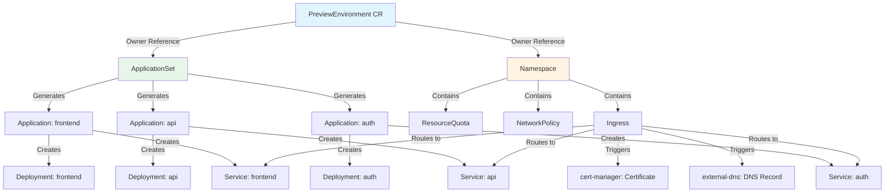
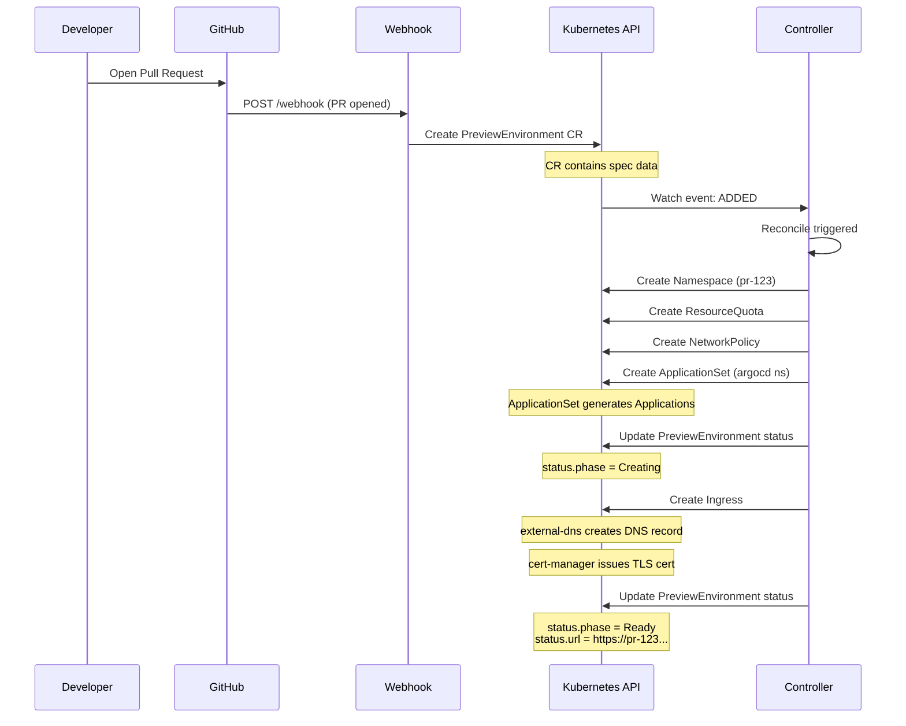
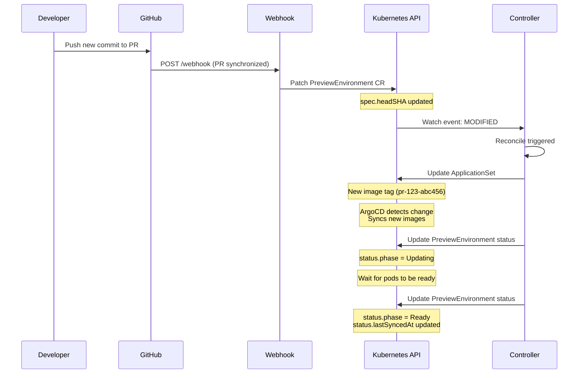
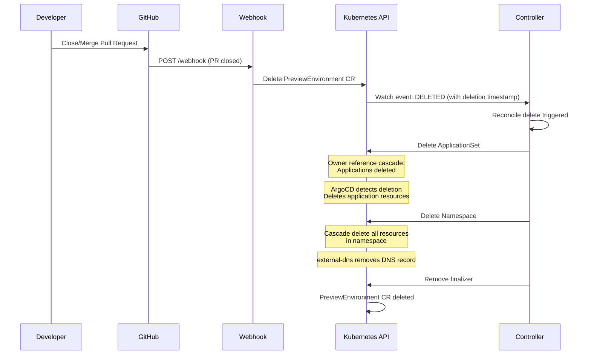
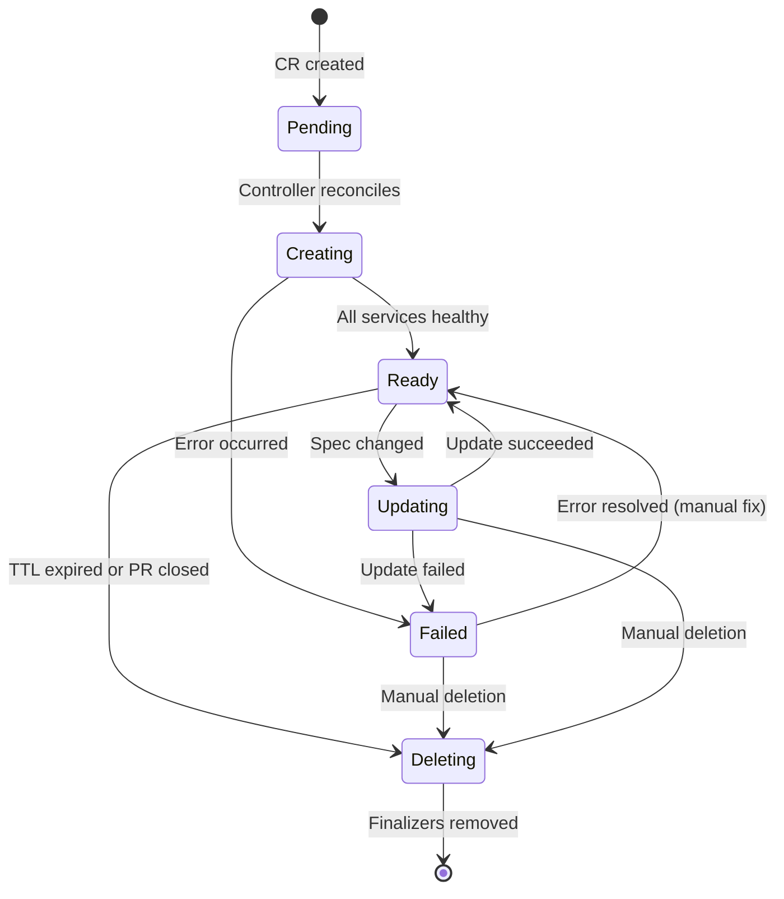

# Data Model

## Overview

This document defines the data structures used in Previewd, including the PreviewEnvironment Custom Resource Definition (CRD), related Kubernetes resources, and their relationships.

## PreviewEnvironment Custom Resource

### API Group and Version

```yaml
apiVersion: preview.previewd.io/v1alpha1
kind: PreviewEnvironment
```

### Full CRD Schema

```go
package v1alpha1

import (
    corev1 "k8s.io/api/core/v1"
    metav1 "k8s.io/apimachinery/pkg/apis/meta/v1"
)

// PreviewEnvironmentSpec defines the desired state of PreviewEnvironment
type PreviewEnvironmentSpec struct {
    // Repository is the full GitHub repository name (owner/repo)
    // +kubebuilder:validation:Required
    // +kubebuilder:validation:Pattern=`^[a-zA-Z0-9_-]+/[a-zA-Z0-9_-]+$`
    Repository string `json:"repository"`

    // PRNumber is the pull request number
    // +kubebuilder:validation:Required
    // +kubebuilder:validation:Minimum=1
    PRNumber int `json:"prNumber"`

    // HeadSHA is the commit SHA of the PR head
    // +kubebuilder:validation:Required
    // +kubebuilder:validation:MinLength=40
    // +kubebuilder:validation:MaxLength=40
    HeadSHA string `json:"headSHA"`

    // BaseBranch is the target branch (e.g., "main")
    // +kubebuilder:validation:Required
    BaseBranch string `json:"baseBranch"`

    // HeadBranch is the source branch (e.g., "feature/new-api")
    // +kubebuilder:validation:Required
    HeadBranch string `json:"headBranch"`

    // Services is a list of services to deploy (optional, detected by AI if empty)
    // +optional
    Services []string `json:"services,omitempty"`

    // TTL is the time-to-live duration (e.g., "4h", "24h")
    // +optional
    // +kubebuilder:default="4h"
    TTL metav1.Duration `json:"ttl,omitempty"`

    // Resources defines resource requests/limits for the preview environment
    // +optional
    Resources *PreviewResources `json:"resources,omitempty"`

    // Config contains additional configuration for the preview
    // +optional
    Config *PreviewConfig `json:"config,omitempty"`
}

// PreviewResources defines resource requests and limits
type PreviewResources struct {
    // Requests defines minimum resource requirements
    // +optional
    Requests corev1.ResourceList `json:"requests,omitempty"`

    // Limits defines maximum resource usage
    // +optional
    Limits corev1.ResourceList `json:"limits,omitempty"`
}

// PreviewConfig contains additional configuration
type PreviewConfig struct {
    // Domain is the base domain for preview URLs (e.g., "preview.company.com")
    // +optional
    // +kubebuilder:default="preview.local"
    Domain string `json:"domain,omitempty"`

    // TLSEnabled controls whether to provision TLS certificates
    // +optional
    // +kubebuilder:default=true
    TLSEnabled bool `json:"tlsEnabled,omitempty"`

    // NetworkPolicy controls whether to create restrictive network policies
    // +optional
    // +kubebuilder:default=true
    NetworkPolicy bool `json:"networkPolicy,omitempty"`

    // Labels are additional labels to apply to all resources
    // +optional
    Labels map[string]string `json:"labels,omitempty"`

    // Annotations are additional annotations to apply to all resources
    // +optional
    Annotations map[string]string `json:"annotations,omitempty"`
}

// PreviewEnvironmentStatus defines the observed state of PreviewEnvironment
type PreviewEnvironmentStatus struct {
    // Conditions represent the latest available observations of the environment's state
    // +optional
    // +patchMergeKey=type
    // +patchStrategy=merge
    // +listType=map
    // +listMapKey=type
    Conditions []metav1.Condition `json:"conditions,omitempty" patchStrategy:"merge" patchMergeKey:"type"`

    // Phase is the current phase of the preview environment
    // +optional
    // +kubebuilder:validation:Enum=Pending;Creating;Ready;Updating;Deleting;Failed
    Phase PreviewPhase `json:"phase,omitempty"`

    // URL is the preview environment URL
    // +optional
    URL string `json:"url,omitempty"`

    // Namespace is the Kubernetes namespace created for this preview
    // +optional
    Namespace string `json:"namespace,omitempty"`

    // Services contains status of each deployed service
    // +optional
    Services []ServiceStatus `json:"services,omitempty"`

    // CostEstimate contains resource cost information
    // +optional
    CostEstimate *CostEstimate `json:"costEstimate,omitempty"`

    // CreatedAt is when the environment was created
    // +optional
    CreatedAt *metav1.Time `json:"createdAt,omitempty"`

    // ExpiresAt is when the environment will be deleted (TTL)
    // +optional
    ExpiresAt *metav1.Time `json:"expiresAt,omitempty"`

    // LastSyncedAt is when the environment was last synced with ArgoCD
    // +optional
    LastSyncedAt *metav1.Time `json:"lastSyncedAt,omitempty"`

    // ObservedGeneration is the generation observed by the controller
    // +optional
    ObservedGeneration int64 `json:"observedGeneration,omitempty"`
}

// PreviewPhase represents the lifecycle phase of a preview environment
// +kubebuilder:validation:Enum=Pending;Creating;Ready;Updating;Deleting;Failed
type PreviewPhase string

const (
    PhasePending  PreviewPhase = "Pending"
    PhaseCreating PreviewPhase = "Creating"
    PhaseReady    PreviewPhase = "Ready"
    PhaseUpdating PreviewPhase = "Updating"
    PhaseDeleting PreviewPhase = "Deleting"
    PhaseFailed   PreviewPhase = "Failed"
)

// ServiceStatus represents the status of a single service
type ServiceStatus struct {
    // Name is the service name
    Name string `json:"name"`

    // Ready indicates if the service is ready
    Ready bool `json:"ready"`

    // Health is the health status (Healthy, Progressing, Degraded, Missing)
    // +optional
    Health string `json:"health,omitempty"`

    // SyncStatus is the ArgoCD sync status (Synced, OutOfSync, Unknown)
    // +optional
    SyncStatus string `json:"syncStatus,omitempty"`

    // URL is the service URL (if exposed)
    // +optional
    URL string `json:"url,omitempty"`
}

// CostEstimate contains resource cost information
type CostEstimate struct {
    // CPU is the total CPU allocated (e.g., "1.5")
    CPU string `json:"cpu"`

    // Memory is the total memory allocated (e.g., "3Gi")
    Memory string `json:"memory"`

    // HourlyCost is the estimated hourly cost in USD
    HourlyCost float64 `json:"hourlyCost"`

    // DailyCost is the estimated daily cost in USD
    DailyCost float64 `json:"dailyCost"`

    // MonthlyCost is the estimated monthly cost in USD
    MonthlyCost float64 `json:"monthlyCost"`
}

// +kubebuilder:object:root=true
// +kubebuilder:subresource:status
// +kubebuilder:resource:scope=Namespaced,shortName=preview;previews
// +kubebuilder:printcolumn:name="PR",type=integer,JSONPath=`.spec.prNumber`
// +kubebuilder:printcolumn:name="Phase",type=string,JSONPath=`.status.phase`
// +kubebuilder:printcolumn:name="URL",type=string,JSONPath=`.status.url`
// +kubebuilder:printcolumn:name="Age",type=date,JSONPath=`.metadata.creationTimestamp`

// PreviewEnvironment is the Schema for the previewenvironments API
type PreviewEnvironment struct {
    metav1.TypeMeta   `json:",inline"`
    metav1.ObjectMeta `json:"metadata,omitempty"`

    Spec   PreviewEnvironmentSpec   `json:"spec,omitempty"`
    Status PreviewEnvironmentStatus `json:"status,omitempty"`
}

// +kubebuilder:object:root=true

// PreviewEnvironmentList contains a list of PreviewEnvironment
type PreviewEnvironmentList struct {
    metav1.TypeMeta `json:",inline"`
    metav1.ListMeta `json:"metadata,omitempty"`
    Items           []PreviewEnvironment `json:"items"`
}

func init() {
    SchemeBuilder.Register(&PreviewEnvironment{}, &PreviewEnvironmentList{})
}
```

### Status Conditions

**Condition Types**:

| Type | Status | Reason | Description |
|------|--------|--------|-------------|
| Ready | True | EnvironmentReady | All services are running and healthy |
| Ready | False | Creating | Environment is being created |
| Ready | False | Updating | Environment is being updated |
| Ready | False | Failed | Environment creation/update failed |
| Deploying | True | CreatingNamespace | Namespace is being created |
| Deploying | True | CreatingApplicationSet | ApplicationSet is being created |
| Deploying | True | WaitingForSync | Waiting for ArgoCD to sync |
| Deploying | False | DeploymentComplete | All applications synced |
| Failed | True | NamespaceCreationFailed | Failed to create namespace |
| Failed | True | ApplicationSetCreationFailed | Failed to create ApplicationSet |
| Failed | True | SyncFailed | ArgoCD sync failed |
| Failed | False | NoErrors | No errors detected |

### Example Instance

```yaml
apiVersion: preview.previewd.io/v1alpha1
kind: PreviewEnvironment
metadata:
  name: pr-123
  namespace: previewd-system
  labels:
    preview.previewd.io/repository: company-monorepo
    preview.previewd.io/pr: "123"
  finalizers:
    - preview.previewd.io/finalizer
spec:
  repository: company/monorepo
  prNumber: 123
  headSHA: abc123def456
  baseBranch: main
  headBranch: feature/new-api
  ttl: 4h
  services:
    - auth
    - api
    - frontend
  resources:
    requests:
      cpu: "500m"
      memory: "1Gi"
    limits:
      cpu: "2"
      memory: "4Gi"
  config:
    domain: preview.company.com
    tlsEnabled: true
    networkPolicy: true
    labels:
      team: platform
      environment: preview
status:
  phase: Ready
  conditions:
    - type: Ready
      status: "True"
      reason: EnvironmentReady
      message: All services are running
      lastTransitionTime: "2025-11-09T10:35:00Z"
    - type: Deploying
      status: "False"
      reason: DeploymentComplete
      lastTransitionTime: "2025-11-09T10:35:00Z"
    - type: Failed
      status: "False"
      reason: NoErrors
      lastTransitionTime: "2025-11-09T10:30:00Z"
  url: https://pr-123.preview.company.com
  namespace: pr-123
  services:
    - name: auth
      ready: true
      health: Healthy
      syncStatus: Synced
      url: https://pr-123.preview.company.com/auth
    - name: api
      ready: true
      health: Healthy
      syncStatus: Synced
      url: https://pr-123.preview.company.com/api
    - name: frontend
      ready: true
      health: Healthy
      syncStatus: Synced
      url: https://pr-123.preview.company.com
  costEstimate:
    cpu: "1.5"
    memory: "3Gi"
    hourlyCost: 0.075
    dailyCost: 1.80
    monthlyCost: 54.00
  createdAt: "2025-11-09T10:30:00Z"
  expiresAt: "2025-11-09T14:30:00Z"
  lastSyncedAt: "2025-11-09T10:35:00Z"
  observedGeneration: 1
```

## Resource Relationships



## Related Kubernetes Resources

### Namespace

**Purpose**: Isolation boundary for preview environment

**Naming**: `pr-{number}` (e.g., `pr-123`)

**Labels**:
```yaml
apiVersion: v1
kind: Namespace
metadata:
  name: pr-123
  labels:
    preview.previewd.io/pr: "123"
    preview.previewd.io/repository: company-monorepo
    preview.previewd.io/managed-by: previewd
  ownerReferences:
    - apiVersion: preview.previewd.io/v1alpha1
      kind: PreviewEnvironment
      name: pr-123
      uid: abc-123-def
      controller: true
      blockOwnerDeletion: true
```

### ResourceQuota

**Purpose**: Limit resource consumption per preview

```yaml
apiVersion: v1
kind: ResourceQuota
metadata:
  name: preview-quota
  namespace: pr-123
spec:
  hard:
    requests.cpu: "2"
    requests.memory: 4Gi
    limits.cpu: "4"
    limits.memory: 8Gi
    persistentvolumeclaims: "0"  # No persistent storage
    services.loadbalancers: "0"  # No external load balancers
```

### NetworkPolicy

**Purpose**: Restrict network traffic for security

```yaml
apiVersion: networking.k8s.io/v1
kind: NetworkPolicy
metadata:
  name: default-deny-all
  namespace: pr-123
spec:
  podSelector: {}
  policyTypes:
    - Ingress
    - Egress
---
apiVersion: networking.k8s.io/v1
kind: NetworkPolicy
metadata:
  name: allow-ingress
  namespace: pr-123
spec:
  podSelector: {}
  policyTypes:
    - Ingress
  ingress:
    - from:
        - namespaceSelector:
            matchLabels:
              name: ingress-nginx
      ports:
        - protocol: TCP
          port: 8080
---
apiVersion: networking.k8s.io/v1
kind: NetworkPolicy
metadata:
  name: allow-egress-dns
  namespace: pr-123
spec:
  podSelector: {}
  policyTypes:
    - Egress
  egress:
    - to:
        - namespaceSelector:
            matchLabels:
              name: kube-system
      ports:
        - protocol: UDP
          port: 53
    - to:
        - podSelector: {}
      ports:
        - protocol: TCP
          port: 80
        - protocol: TCP
          port: 443
```

### ApplicationSet

**Purpose**: Generate ArgoCD Applications for each service

```yaml
apiVersion: argoproj.io/v1alpha1
kind: ApplicationSet
metadata:
  name: preview-123
  namespace: argocd
  labels:
    preview.previewd.io/pr: "123"
  ownerReferences:
    - apiVersion: preview.previewd.io/v1alpha1
      kind: PreviewEnvironment
      name: pr-123
      uid: abc-123-def
      controller: true
      blockOwnerDeletion: true
spec:
  generators:
    - list:
        elements:
          - service: auth
            repo: https://github.com/company/services
            path: auth/k8s
          - service: api
            repo: https://github.com/company/services
            path: api/k8s
          - service: frontend
            repo: https://github.com/company/services
            path: frontend/k8s
  template:
    metadata:
      name: 'preview-123-{{service}}'
      labels:
        preview.previewd.io/pr: "123"
        preview.previewd.io/service: '{{service}}'
    spec:
      project: default
      source:
        repoURL: '{{repo}}'
        targetRevision: main
        path: '{{path}}'
        kustomize:
          namePrefix: 'pr-123-'
          namespace: pr-123
          commonLabels:
            preview.previewd.io/pr: "123"
            preview.previewd.io/service: '{{service}}'
          images:
            - 'company/{{service}}:pr-123'  # Use PR-specific image tag
      destination:
        server: https://kubernetes.default.svc
        namespace: pr-123
      syncPolicy:
        automated:
          prune: true
          selfHeal: true
        syncOptions:
          - CreateNamespace=false  # Namespace already created by operator
          - PruneLast=true
      ignoreDifferences:
        - group: apps
          kind: Deployment
          jsonPointers:
            - /spec/replicas  # Allow HPA to manage replicas
```

### Ingress

**Purpose**: Route HTTP(S) traffic to services

```yaml
apiVersion: networking.k8s.io/v1
kind: Ingress
metadata:
  name: preview-ingress
  namespace: pr-123
  annotations:
    cert-manager.io/cluster-issuer: letsencrypt-prod
    nginx.ingress.kubernetes.io/ssl-redirect: "true"
    external-dns.alpha.kubernetes.io/hostname: pr-123.preview.company.com
  labels:
    preview.previewd.io/pr: "123"
spec:
  ingressClassName: nginx
  tls:
    - hosts:
        - pr-123.preview.company.com
      secretName: pr-123-tls
  rules:
    - host: pr-123.preview.company.com
      http:
        paths:
          - path: /auth
            pathType: Prefix
            backend:
              service:
                name: pr-123-auth
                port:
                  number: 8080
          - path: /api
            pathType: Prefix
            backend:
              service:
                name: pr-123-api
                port:
                  number: 8080
          - path: /
            pathType: Prefix
            backend:
              service:
                name: pr-123-frontend
                port:
                  number: 8080
```

## Data Flow Diagrams

### Create Preview Environment



### Update Preview Environment



### Delete Preview Environment



## State Machine



**State Transitions**:

| From | To | Trigger | Actions |
|------|-----|---------|---------|
| - | Pending | CR created | Initial state |
| Pending | Creating | Reconcile | Create namespace, ApplicationSet |
| Creating | Ready | Applications synced | Update status.url, emit event |
| Creating | Failed | Error | Set Failed condition, requeue |
| Ready | Updating | Spec changed | Update ApplicationSet |
| Updating | Ready | Sync complete | Update status.lastSyncedAt |
| Updating | Failed | Sync failed | Set Failed condition |
| Ready | Deleting | TTL expired or PR closed | Add deletion timestamp |
| Failed | Deleting | Manual delete | Add deletion timestamp |
| Deleting | (removed) | Finalizers removed | CR deleted |

## Validation Rules

**Spec Validation** (via Kubebuilder markers):

```go
// Repository format: owner/repo
// +kubebuilder:validation:Pattern=`^[a-zA-Z0-9_-]+/[a-zA-Z0-9_-]+$`

// PRNumber must be positive
// +kubebuilder:validation:Minimum=1

// HeadSHA must be 40-char hex (Git SHA-1)
// +kubebuilder:validation:MinLength=40
// +kubebuilder:validation:MaxLength=40

// TTL format (e.g., "4h", "24h")
// +kubebuilder:validation:Pattern=`^([0-9]+h)?([0-9]+m)?([0-9]+s)?$`

// Phase enum
// +kubebuilder:validation:Enum=Pending;Creating;Ready;Updating;Deleting;Failed
```

**Admission Webhook** (optional, v0.3.0+):

```go
// ValidateCreate validates new PreviewEnvironment
func (r *PreviewEnvironment) ValidateCreate() error {
    // Check repository access (GitHub API)
    // Validate PR exists and is open
    // Check resource limits against cluster capacity
}

// ValidateUpdate validates updates
func (r *PreviewEnvironment) ValidateUpdate(old runtime.Object) error {
    // Prevent changing repository or PR number
    // Validate TTL extension is within limits
}

// ValidateDelete validates deletion
func (r *PreviewEnvironment) ValidateDelete() error {
    // Allow deletion only if no "do-not-expire" label
}
```

## Indexing and Queries

**Controller-Runtime Indexes**:

```go
// Index by PR number for fast lookup
mgr.GetFieldIndexer().IndexField(ctx, &previewv1alpha1.PreviewEnvironment{}, "spec.prNumber", func(obj client.Object) []string {
    preview := obj.(*previewv1alpha1.PreviewEnvironment)
    return []string{strconv.Itoa(preview.Spec.PRNumber)}
})

// Index by repository for listing previews per repo
mgr.GetFieldIndexer().IndexField(ctx, &previewv1alpha1.PreviewEnvironment{}, "spec.repository", func(obj client.Object) []string {
    preview := obj.(*previewv1alpha1.PreviewEnvironment)
    return []string{preview.Spec.Repository}
})

// Index by phase for querying active/failed previews
mgr.GetFieldIndexer().IndexField(ctx, &previewv1alpha1.PreviewEnvironment{}, "status.phase", func(obj client.Object) []string {
    preview := obj.(*previewv1alpha1.PreviewEnvironment)
    return []string{string(preview.Status.Phase)}
})
```

**Query Examples**:

```go
// Find preview for PR #123
var previews previewv1alpha1.PreviewEnvironmentList
err := k8sClient.List(ctx, &previews, client.MatchingFields{"spec.prNumber": "123"})

// List all previews for repository
err := k8sClient.List(ctx, &previews, client.MatchingFields{"spec.repository": "company/monorepo"})

// List all failed previews
err := k8sClient.List(ctx, &previews, client.MatchingFields{"status.phase": "Failed"})

// List previews expiring soon (TTL check)
var allPreviews previewv1alpha1.PreviewEnvironmentList
err := k8sClient.List(ctx, &allPreviews)
for _, preview := range allPreviews.Items {
    if preview.Status.ExpiresAt != nil && time.Until(preview.Status.ExpiresAt.Time) < 10*time.Minute {
        // Preview expiring soon
    }
}
```

## Metrics Data Model

**Prometheus Metrics Schema**:

```
# Preview environment counts by status
previewd_environments_total{status="active"}    42
previewd_environments_total{status="failed"}    3
previewd_environments_total{status="deleting"}  1

# Creation duration histogram (buckets: 10s, 30s, 60s, 120s, 300s)
previewd_environment_creation_duration_seconds_bucket{repository="company/monorepo",le="10"}    5
previewd_environment_creation_duration_seconds_bucket{repository="company/monorepo",le="30"}    23
previewd_environment_creation_duration_seconds_bucket{repository="company/monorepo",le="60"}    38
previewd_environment_creation_duration_seconds_bucket{repository="company/monorepo",le="120"}   42
previewd_environment_creation_duration_seconds_bucket{repository="company/monorepo",le="+Inf"}  42

# Cost tracking
previewd_environment_cost_estimate_usd{pr_number="123"}  0.075  # Hourly cost
previewd_total_cost_usd  3.15  # Sum of all active previews

# AI metrics (v0.2.0+)
previewd_ai_requests_total{provider="openai",cache_hit="true"}   145
previewd_ai_requests_total{provider="openai",cache_hit="false"}  28
previewd_ai_cost_usd_total  2.35  # Cumulative AI API costs
```

## Configuration Data Model

**ConfigMap Schema**:

```yaml
apiVersion: v1
kind: ConfigMap
metadata:
  name: previewd-config
  namespace: previewd-system
data:
  config.yaml: |
    # GitHub configuration
    github:
      apiURL: https://api.github.com
      webhookPath: /webhook

    # ArgoCD configuration
    argocd:
      namespace: argocd
      project: default
      syncPolicy:
        automated: true
        prune: true
        selfHeal: true

    # AI configuration (v0.2.0+)
    ai:
      enabled: true
      provider: openai
      model: gpt-4
      temperature: 0.0
      maxTokens: 1000
      cache:
        enabled: true
        ttl: 1h
        backend: memory  # memory, redis

    # Default settings
    defaults:
      ttl: 4h
      maxTTL: 168h  # 7 days
      domain: preview.local
      tlsEnabled: true
      networkPolicy: true

      resources:
        requests:
          cpu: 100m
          memory: 256Mi
        limits:
          cpu: 500m
          memory: 512Mi

    # Cost configuration
    costs:
      cpuPerCoreHour: 0.04
      memoryPerGBHour: 0.005
      storagePerGBMonth: 0.10
      currency: USD

    # Cleanup configuration
    cleanup:
      interval: 5m
      forceDeleteAfter: 168h  # 7 days

    # Observability
    observability:
      metricsPort: 8080
      healthPort: 8081
      logLevel: info
      logFormat: json
```

**Secret Schema**:

```yaml
apiVersion: v1
kind: Secret
metadata:
  name: previewd-secrets
  namespace: previewd-system
type: Opaque
stringData:
  github-token: ghp_xxxxxxxxxxxx
  github-webhook-secret: xxxxxxxxxxxxxxxx
  openai-api-key: sk-xxxxxxxxxxxx  # v0.2.0+
```

## Migration Path (Future Versions)

**v1alpha1 → v1beta1**:
- Add `.spec.schedule` for scheduled cleanup
- Add `.spec.replicas` per service
- Add `.status.metrics` (CPU/memory usage)
- Add `.spec.dependencies` (external services like databases)

**Conversion Webhook**:
```go
func (r *PreviewEnvironment) ConvertTo(dstRaw conversion.Hub) error {
    dst := dstRaw.(*v1beta1.PreviewEnvironment)

    // Copy spec fields
    dst.Spec.Repository = r.Spec.Repository
    dst.Spec.PRNumber = r.Spec.PRNumber
    // ... other fields

    // Set defaults for new fields
    if dst.Spec.Schedule == nil {
        dst.Spec.Schedule = &v1beta1.Schedule{Type: "OnDemand"}
    }

    return nil
}
```

---

**Document Status**: ✅ Complete
**Last Updated**: 2025-11-09
**Authors**: Mike Lane (@mikelane)
