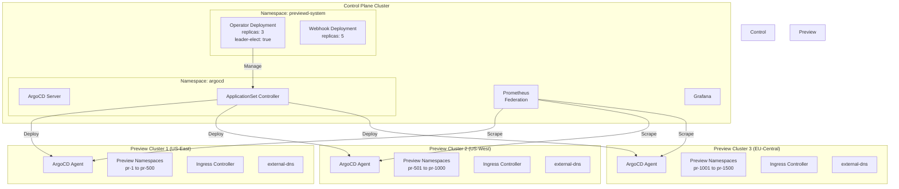
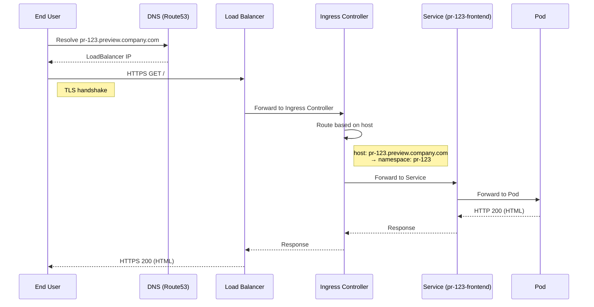

# Deployment Architecture

## Overview

This document describes the deployment topology for Previewd, including infrastructure requirements, resource specifications, and production deployment considerations.

## Deployment Topologies

### Single-Cluster Deployment (Recommended for v0.1.0)

```mermaid
graph TB
    subgraph "Kubernetes Cluster"
        subgraph "System Namespace: previewd-system"
            OpDeploy[Operator Deployment<br/>replicas: 1<br/>leader-elect: false]
            WHDeploy[Webhook Deployment<br/>replicas: 3]
            WHSvc[Webhook Service<br/>type: LoadBalancer]
            ConfigMap[ConfigMap<br/>previewd-config]
            Secrets[Secret<br/>previewd-secrets]
        end

        subgraph "ArgoCD Namespace: argocd"
            ArgoCDServer[ArgoCD Server]
            AppSetCtrl[ApplicationSet Controller]
            RepoServer[Repo Server]
        end

        subgraph "Ingress Namespace: ingress-nginx"
            IngressCtrl[Ingress Controller<br/>type: LoadBalancer]
        end

        subgraph "Cert-Manager Namespace: cert-manager"
            CertMgr[cert-manager Controller]
            ClusterIssuer[ClusterIssuer<br/>letsencrypt-prod]
        end

        subgraph "External-DNS Namespace: external-dns"
            ExtDNS[external-dns Controller]
        end

        subgraph "Preview Namespace: pr-123"
            AuthDeploy[Deployment: pr-123-auth]
            APIDeploy[Deployment: pr-123-api]
            FrontendDeploy[Deployment: pr-123-frontend]
            AuthSvc[Service: pr-123-auth]
            APISvc[Service: pr-123-api]
            FrontendSvc[Service: pr-123-frontend]
            Ingress[Ingress<br/>pr-123.preview.company.com]
            Quota[ResourceQuota]
            NetPol[NetworkPolicy]
        end

        subgraph "Preview Namespace: pr-456"
            PR456[...]
        end

        subgraph "Monitoring Namespace: monitoring"
            Prometheus[Prometheus]
            Grafana[Grafana]
            AlertManager[AlertManager]
        end
    end

    subgraph "External Systems"
        GitHub[GitHub]
        DNS[DNS Provider<br/>Route53/CloudDNS]
        OpenAI[OpenAI API]
    end

    GitHub -->|Webhooks| WHSvc
    OpDeploy -->|Watch| ConfigMap
    OpDeploy -->|Watch| Secrets
    OpDeploy -->|Create| AppSetCtrl
    AppSetCtrl -->|Generate| AuthDeploy
    AppSetCtrl -->|Generate| APIDeploy
    Ingress -->|Route| AuthSvc
    Ingress -->|Route| APISvc
    IngressCtrl -->|Serve| Ingress
    ExtDNS -->|Update| DNS
    CertMgr -->|TLS| Ingress
    OpDeploy -->|API| GitHub
    OpDeploy -->|API| OpenAI
    Prometheus -->|Scrape| OpDeploy
    Prometheus -->|Scrape| WHDeploy

    style System Namespace fill:#e1f5ff
    style ArgoCD Namespace fill:#e8f5e9
    style Preview Namespace fill:#fff4e1
```



**Characteristics**:
- Simple to operate and maintain
- Lower cost (shared control plane)
- Suitable for teams with <100 concurrent previews
- Single point of failure (cluster-level)

**When to Use**:
- Development and staging environments
- Small to medium teams (<50 developers)
- Budget-constrained deployments
- Getting started with Previewd

---

### Multi-Cluster Deployment (Enterprise)



**Characteristics**:
- Horizontal scalability (add more preview clusters)
- Geographic distribution (reduce latency)
- Blast radius isolation
- Higher operational complexity

**When to Use**:
- Large enterprises (>100 concurrent previews)
- Multi-region deployments
- High availability requirements (99.99% uptime)
- Compliance/security isolation needs

---

## Component Specifications

### Operator Deployment

```yaml
apiVersion: apps/v1
kind: Deployment
metadata:
  name: previewd-controller-manager
  namespace: previewd-system
  labels:
    app: previewd
    component: controller
spec:
  replicas: 1  # Single replica (leader election disabled)
  selector:
    matchLabels:
      app: previewd
      component: controller
  template:
    metadata:
      labels:
        app: previewd
        component: controller
      annotations:
        prometheus.io/scrape: "true"
        prometheus.io/port: "8080"
        prometheus.io/path: "/metrics"
    spec:
      serviceAccountName: previewd-controller-manager
      securityContext:
        runAsNonRoot: true
        runAsUser: 65532
        fsGroup: 65532
      containers:
        - name: manager
          image: ghcr.io/mikelane/previewd:v0.1.0
          imagePullPolicy: IfNotPresent
          command:
            - /manager
          args:
            - --metrics-bind-address=:8080
            - --health-probe-bind-address=:8081
            - --leader-elect=false
          env:
            - name: GITHUB_TOKEN
              valueFrom:
                secretKeyRef:
                  name: previewd-secrets
                  key: github-token
            - name: GITHUB_WEBHOOK_SECRET
              valueFrom:
                secretKeyRef:
                  name: previewd-secrets
                  key: github-webhook-secret
            - name: OPENAI_API_KEY  # v0.2.0+
              valueFrom:
                secretKeyRef:
                  name: previewd-secrets
                  key: openai-api-key
                  optional: true
          ports:
            - name: metrics
              containerPort: 8080
              protocol: TCP
            - name: health
              containerPort: 8081
              protocol: TCP
          livenessProbe:
            httpGet:
              path: /healthz
              port: 8081
            initialDelaySeconds: 15
            periodSeconds: 20
            timeoutSeconds: 5
          readinessProbe:
            httpGet:
              path: /readyz
              port: 8081
            initialDelaySeconds: 5
            periodSeconds: 10
            timeoutSeconds: 5
          resources:
            requests:
              cpu: 100m
              memory: 128Mi
            limits:
              cpu: 500m
              memory: 512Mi
          securityContext:
            allowPrivilegeEscalation: false
            readOnlyRootFilesystem: true
            capabilities:
              drop:
                - ALL
          volumeMounts:
            - name: config
              mountPath: /etc/previewd
              readOnly: true
      volumes:
        - name: config
          configMap:
            name: previewd-config
      terminationGracePeriodSeconds: 30
```

**Resource Sizing**:
- **Development**: 100m CPU, 128Mi memory
- **Production (1-50 previews)**: 500m CPU, 512Mi memory
- **Production (50-500 previews)**: 1 CPU, 1Gi memory
- **Production (>500 previews)**: 2 CPU, 2Gi memory

**Scaling Strategy**:
- v0.1.0: Single replica (leader election disabled)
- v0.2.0+: Multiple replicas with leader election (HA)

---

### Webhook Deployment

```yaml
apiVersion: apps/v1
kind: Deployment
metadata:
  name: previewd-webhook
  namespace: previewd-system
  labels:
    app: previewd
    component: webhook
spec:
  replicas: 3  # Multiple replicas for HA
  selector:
    matchLabels:
      app: previewd
      component: webhook
  template:
    metadata:
      labels:
        app: previewd
        component: webhook
      annotations:
        prometheus.io/scrape: "true"
        prometheus.io/port: "8080"
    spec:
      serviceAccountName: previewd-webhook
      securityContext:
        runAsNonRoot: true
        runAsUser: 65532
        fsGroup: 65532
      containers:
        - name: webhook
          image: ghcr.io/mikelane/previewd:v0.1.0
          imagePullPolicy: IfNotPresent
          command:
            - /webhook
          args:
            - --webhook-bind-address=0.0.0.0
            - --webhook-port=9443
            - --metrics-bind-address=:8080
          env:
            - name: GITHUB_WEBHOOK_SECRET
              valueFrom:
                secretKeyRef:
                  name: previewd-secrets
                  key: github-webhook-secret
          ports:
            - name: webhook
              containerPort: 9443
              protocol: TCP
            - name: metrics
              containerPort: 8080
              protocol: TCP
          livenessProbe:
            httpGet:
              path: /healthz
              port: 9443
            initialDelaySeconds: 10
            periodSeconds: 15
          readinessProbe:
            httpGet:
              path: /healthz
              port: 9443
            initialDelaySeconds: 5
            periodSeconds: 10
          resources:
            requests:
              cpu: 50m
              memory: 64Mi
            limits:
              cpu: 200m
              memory: 256Mi
          securityContext:
            allowPrivilegeEscalation: false
            readOnlyRootFilesystem: true
            capabilities:
              drop:
                - ALL
---
apiVersion: v1
kind: Service
metadata:
  name: previewd-webhook
  namespace: previewd-system
spec:
  type: LoadBalancer  # Or use Ingress
  selector:
    app: previewd
    component: webhook
  ports:
    - name: webhook
      port: 443
      targetPort: 9443
      protocol: TCP
  sessionAffinity: None
---
apiVersion: policy/v1
kind: PodDisruptionBudget
metadata:
  name: previewd-webhook
  namespace: previewd-system
spec:
  minAvailable: 2
  selector:
    matchLabels:
      app: previewd
      component: webhook
```

**Scaling Strategy**:
- **Minimum replicas**: 3 (HA)
- **HPA**: Scale based on webhook request rate
- **Target**: <100ms webhook response time

---

## Infrastructure Dependencies

### Required Components

| Component | Purpose | Version | Installation |
|-----------|---------|---------|--------------|
| **ArgoCD** | GitOps deployment engine | 2.13+ | `kubectl apply -n argocd -f https://raw.githubusercontent.com/argoproj/argo-cd/stable/manifests/install.yaml` |
| **cert-manager** | TLS certificate management | 1.16+ | `kubectl apply -f https://github.com/cert-manager/cert-manager/releases/download/v1.16.0/cert-manager.yaml` |
| **external-dns** | Automatic DNS record management | 0.15+ | Helm chart: `external-dns/external-dns` |
| **Ingress NGINX** | HTTP(S) ingress controller | 1.11+ | Helm chart: `ingress-nginx/ingress-nginx` |
| **Prometheus** (optional) | Metrics collection | 2.50+ | Helm chart: `prometheus-community/kube-prometheus-stack` |

### ArgoCD Setup

```bash
# Install ArgoCD
kubectl create namespace argocd
kubectl apply -n argocd -f https://raw.githubusercontent.com/argoproj/argo-cd/stable/manifests/install.yaml

# Wait for ArgoCD to be ready
kubectl wait --for=condition=available --timeout=300s deployment/argocd-server -n argocd

# Get admin password
kubectl -n argocd get secret argocd-initial-admin-secret -o jsonpath="{.data.password}" | base64 -d

# Port-forward to access UI
kubectl port-forward svc/argocd-server -n argocd 8080:443
```

### cert-manager Setup

```bash
# Install cert-manager
kubectl apply -f https://github.com/cert-manager/cert-manager/releases/download/v1.16.0/cert-manager.yaml

# Create ClusterIssuer for Let's Encrypt
kubectl apply -f - <<EOF
apiVersion: cert-manager.io/v1
kind: ClusterIssuer
metadata:
  name: letsencrypt-prod
spec:
  acme:
    server: https://acme-v02.api.letsencrypt.org/directory
    email: admin@company.com
    privateKeySecretRef:
      name: letsencrypt-prod
    solvers:
      - http01:
          ingress:
            class: nginx
EOF
```

### external-dns Setup

```bash
# Install external-dns (AWS Route53 example)
helm repo add external-dns https://kubernetes-sigs.github.io/external-dns/
helm install external-dns external-dns/external-dns \
  --namespace external-dns \
  --create-namespace \
  --set provider=aws \
  --set aws.region=us-east-1 \
  --set domainFilters[0]=preview.company.com \
  --set policy=sync
```

### Ingress NGINX Setup

```bash
# Install ingress-nginx
helm repo add ingress-nginx https://kubernetes.github.io/ingress-nginx
helm install ingress-nginx ingress-nginx/ingress-nginx \
  --namespace ingress-nginx \
  --create-namespace \
  --set controller.service.type=LoadBalancer \
  --set controller.metrics.enabled=true \
  --set controller.podAnnotations."prometheus\.io/scrape"=true
```

---

## Installation Methods

### Method 1: Kustomize (Recommended)

**Directory Structure**:
```
config/
├── base/
│   ├── kustomization.yaml
│   ├── manager.yaml
│   ├── webhook.yaml
│   ├── rbac.yaml
│   └── crd/
│       └── previewenvironment_crd.yaml
├── overlays/
│   ├── development/
│   │   └── kustomization.yaml
│   ├── staging/
│   │   └── kustomization.yaml
│   └── production/
│       └── kustomization.yaml
└── samples/
    └── preview_sample.yaml
```

**Install**:
```bash
# Development
kubectl apply -k config/overlays/development

# Production
kubectl apply -k config/overlays/production
```

---

### Method 2: Helm Chart (v0.2.0+)

**values.yaml**:
```yaml
operator:
  replicas: 1
  leaderElect: false
  image:
    repository: ghcr.io/mikelane/previewd
    tag: v0.1.0
    pullPolicy: IfNotPresent
  resources:
    requests:
      cpu: 100m
      memory: 128Mi
    limits:
      cpu: 500m
      memory: 512Mi

webhook:
  enabled: true
  replicas: 3
  service:
    type: LoadBalancer
  resources:
    requests:
      cpu: 50m
      memory: 64Mi
    limits:
      cpu: 200m
      memory: 256Mi

github:
  token: ""  # Set via --set or secret
  webhookSecret: ""

argocd:
  namespace: argocd
  project: default

ai:
  enabled: false  # v0.2.0+
  provider: openai
  apiKey: ""

defaults:
  ttl: 4h
  domain: preview.local
  resources:
    requests:
      cpu: 100m
      memory: 256Mi
    limits:
      cpu: 500m
      memory: 512Mi

monitoring:
  prometheus:
    enabled: true
    serviceMonitor: true
  grafana:
    enabled: true
    dashboards: true
```

**Install**:
```bash
helm repo add previewd https://mikelane.github.io/previewd
helm install previewd previewd/previewd \
  --namespace previewd-system \
  --create-namespace \
  --set github.token=$GITHUB_TOKEN \
  --set github.webhookSecret=$WEBHOOK_SECRET
```

---

## Network Architecture

### Ingress Traffic Flow



### Network Policies

**Default Deny All**:
```yaml
apiVersion: networking.k8s.io/v1
kind: NetworkPolicy
metadata:
  name: default-deny-all
  namespace: pr-123
spec:
  podSelector: {}
  policyTypes:
    - Ingress
    - Egress
```

**Allow Ingress from Ingress Controller**:
```yaml
apiVersion: networking.k8s.io/v1
kind: NetworkPolicy
metadata:
  name: allow-ingress
  namespace: pr-123
spec:
  podSelector: {}
  policyTypes:
    - Ingress
  ingress:
    - from:
        - namespaceSelector:
            matchLabels:
              name: ingress-nginx
      ports:
        - protocol: TCP
          port: 8080
```

**Allow Egress to DNS and Internet**:
```yaml
apiVersion: networking.k8s.io/v1
kind: NetworkPolicy
metadata:
  name: allow-egress
  namespace: pr-123
spec:
  podSelector: {}
  policyTypes:
    - Egress
  egress:
    # Allow DNS
    - to:
        - namespaceSelector:
            matchLabels:
              name: kube-system
      ports:
        - protocol: UDP
          port: 53
    # Allow HTTPS (external APIs)
    - to:
        - podSelector: {}
      ports:
        - protocol: TCP
          port: 443
    # Allow HTTP within namespace
    - to:
        - podSelector: {}
      ports:
        - protocol: TCP
          port: 8080
```

---

## Storage and Persistence

### Operator State

**Storage**: Kubernetes etcd (via CRs)
- No external database required
- PreviewEnvironment CRs are the source of truth
- Leader election uses Lease objects

**Backup Strategy**:
```bash
# Backup all PreviewEnvironment CRs
kubectl get previewenvironments -A -o yaml > backup.yaml

# Backup etcd (cluster-wide)
ETCDCTL_API=3 etcdctl snapshot save snapshot.db
```

### Preview Environment Storage

**Default**: No persistent storage
- Stateless applications only
- Use external databases (RDS, CloudSQL) for stateful data

**Optional PVC Support** (v0.3.0+):
```yaml
apiVersion: preview.previewd.io/v1alpha1
kind: PreviewEnvironment
spec:
  storage:
    enabled: true
    size: 10Gi
    storageClass: fast-ssd
```

---

## Observability

### Prometheus Metrics

**ServiceMonitor** (if using Prometheus Operator):
```yaml
apiVersion: monitoring.coreos.com/v1
kind: ServiceMonitor
metadata:
  name: previewd-controller
  namespace: previewd-system
spec:
  selector:
    matchLabels:
      app: previewd
      component: controller
  endpoints:
    - port: metrics
      path: /metrics
      interval: 30s
```

**Key Metrics**:
```
# Operator health
up{job="previewd-controller"}
controller_runtime_reconcile_total{controller="previewenvironment"}
controller_runtime_reconcile_errors_total

# Preview environments
previewd_environments_total{status="active|failed|deleting"}
previewd_environment_creation_duration_seconds

# Costs
previewd_environment_cost_estimate_usd{pr_number="123"}
sum(previewd_environment_cost_estimate_usd) by (repository)
```

### Grafana Dashboards

**Dashboard 1: Overview**
- Total active previews
- Creation rate (previews/hour)
- Average creation time
- Total cost (hourly, daily, monthly)

**Dashboard 2: Per-Repository**
- Previews by repository
- Cost by repository
- Failure rate by repository

**Dashboard 3: Performance**
- Reconciliation duration (P50, P95, P99)
- Webhook response time
- GitHub API latency

---

## Security

### RBAC

**Operator ClusterRole**:
```yaml
apiVersion: rbac.authorization.k8s.io/v1
kind: ClusterRole
metadata:
  name: previewd-operator
rules:
  # Core resources
  - apiGroups: [""]
    resources: [namespaces, services, configmaps, secrets]
    verbs: [get, list, watch, create, update, patch, delete]

  # ArgoCD resources
  - apiGroups: [argoproj.io]
    resources: [applications, applicationsets]
    verbs: [get, list, watch, create, update, patch, delete]

  # Networking
  - apiGroups: [networking.k8s.io]
    resources: [ingresses, networkpolicies]
    verbs: [get, list, watch, create, update, patch, delete]

  # Custom resources
  - apiGroups: [preview.previewd.io]
    resources: [previewenvironments, previewenvironments/status, previewenvironments/finalizers]
    verbs: [get, list, watch, create, update, patch, delete]

  # Leader election
  - apiGroups: [coordination.k8s.io]
    resources: [leases]
    verbs: [get, create, update]
```

### Secrets Management

**Sealed Secrets** (recommended):
```bash
# Install sealed-secrets
kubectl apply -f https://github.com/bitnami-labs/sealed-secrets/releases/download/v0.24.0/controller.yaml

# Create sealed secret
echo -n "$GITHUB_TOKEN" | kubectl create secret generic previewd-secrets \
  --dry-run=client \
  --from-file=github-token=/dev/stdin \
  -o yaml | \
  kubeseal -o yaml > sealed-secret.yaml

kubectl apply -f sealed-secret.yaml
```

**External Secrets Operator** (alternative):
```yaml
apiVersion: external-secrets.io/v1beta1
kind: ExternalSecret
metadata:
  name: previewd-secrets
  namespace: previewd-system
spec:
  secretStoreRef:
    name: aws-secrets-manager
    kind: SecretStore
  target:
    name: previewd-secrets
  data:
    - secretKey: github-token
      remoteRef:
        key: previewd/github-token
    - secretKey: openai-api-key
      remoteRef:
        key: previewd/openai-api-key
```

---

## Cost Optimization

### Node Affinity (Spot Instances)

```yaml
# Preview environment pods prefer spot nodes
affinity:
  nodeAffinity:
    preferredDuringSchedulingIgnoredDuringExecution:
      - weight: 100
        preference:
          matchExpressions:
            - key: node.kubernetes.io/instance-type
              operator: In
              values: [spot]
```

### Cluster Autoscaler

```yaml
# Cluster autoscaler configuration
apiVersion: v1
kind: ConfigMap
metadata:
  name: cluster-autoscaler-config
  namespace: kube-system
data:
  config.yaml: |
    scale-down-enabled: true
    scale-down-delay-after-add: 5m
    scale-down-unneeded-time: 5m
    skip-nodes-with-system-pods: false
    balance-similar-node-groups: true
```

---

## Disaster Recovery

### Backup Strategy

**What to Backup**:
1. PreviewEnvironment CRs (source of truth)
2. Operator configuration (ConfigMaps, Secrets)
3. ArgoCD Applications/ApplicationSets
4. etcd snapshots (cluster-wide)

**Backup Script**:
```bash
#!/bin/bash
# backup-previewd.sh

DATE=$(date +%Y%m%d-%H%M%S)
BACKUP_DIR="backups/$DATE"

mkdir -p "$BACKUP_DIR"

# Backup PreviewEnvironment CRs
kubectl get previewenvironments -A -o yaml > "$BACKUP_DIR/previewenvironments.yaml"

# Backup ConfigMaps
kubectl get configmap -n previewd-system -o yaml > "$BACKUP_DIR/configmaps.yaml"

# Backup ApplicationSets
kubectl get applicationsets -n argocd -o yaml > "$BACKUP_DIR/applicationsets.yaml"

echo "Backup complete: $BACKUP_DIR"
```

**Restore Script**:
```bash
#!/bin/bash
# restore-previewd.sh

BACKUP_DIR=$1

kubectl apply -f "$BACKUP_DIR/configmaps.yaml"
kubectl apply -f "$BACKUP_DIR/applicationsets.yaml"
kubectl apply -f "$BACKUP_DIR/previewenvironments.yaml"

echo "Restore complete from: $BACKUP_DIR"
```

---

**Document Status**: ✅ Complete
**Last Updated**: 2025-11-09
**Authors**: Mike Lane (@mikelane)
