# Sequence Diagrams

## Overview

This document contains detailed sequence diagrams for key workflows in Previewd. These diagrams illustrate the interactions between components during critical operations.

## 1. PR Opened → Preview Environment Created

### Happy Path

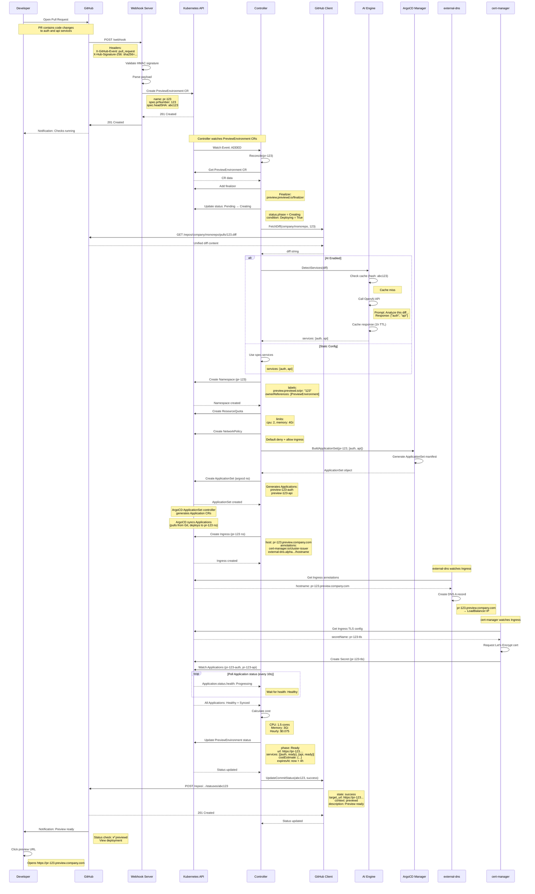

### Error Scenario: GitHub API Failure

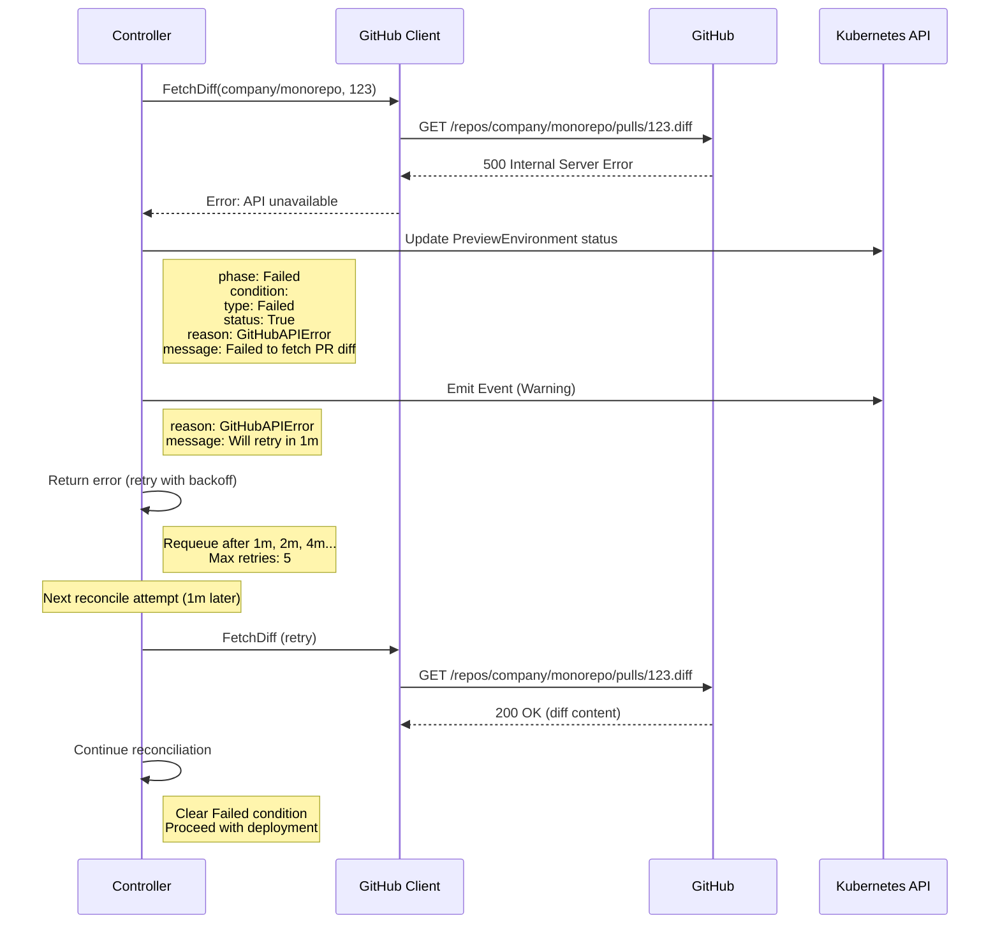

---

## 2. PR Updated → Environment Updated

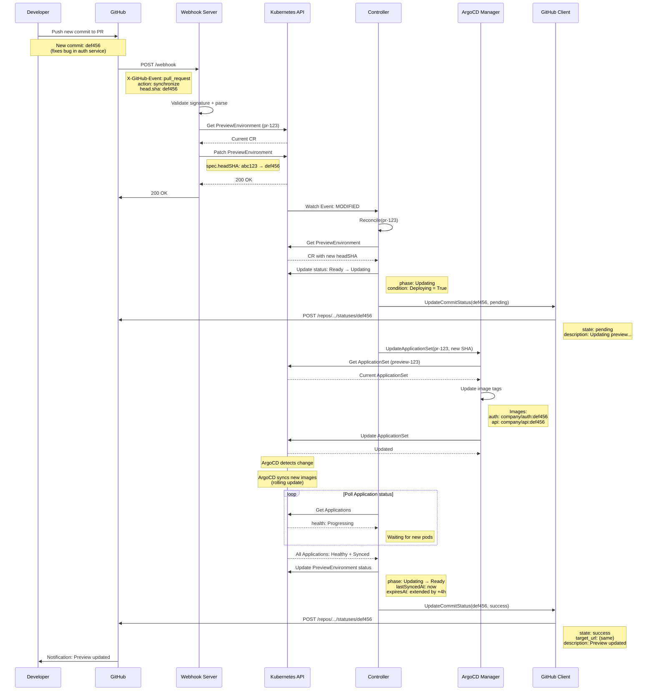

---

## 3. PR Closed → Environment Destroyed

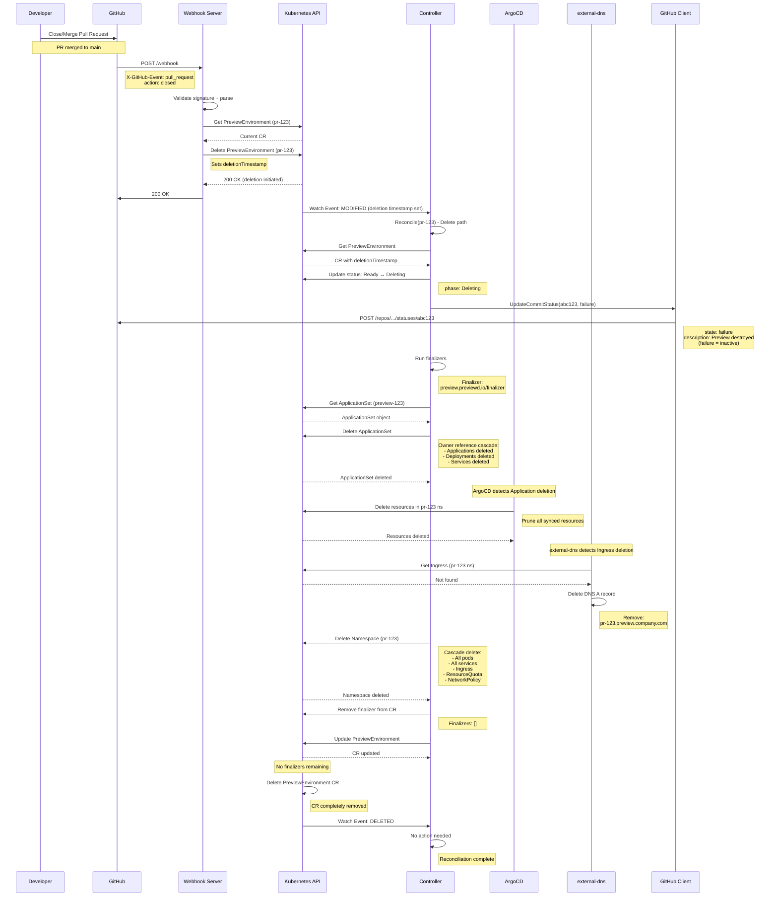

---

## 4. TTL Expired → Automatic Cleanup

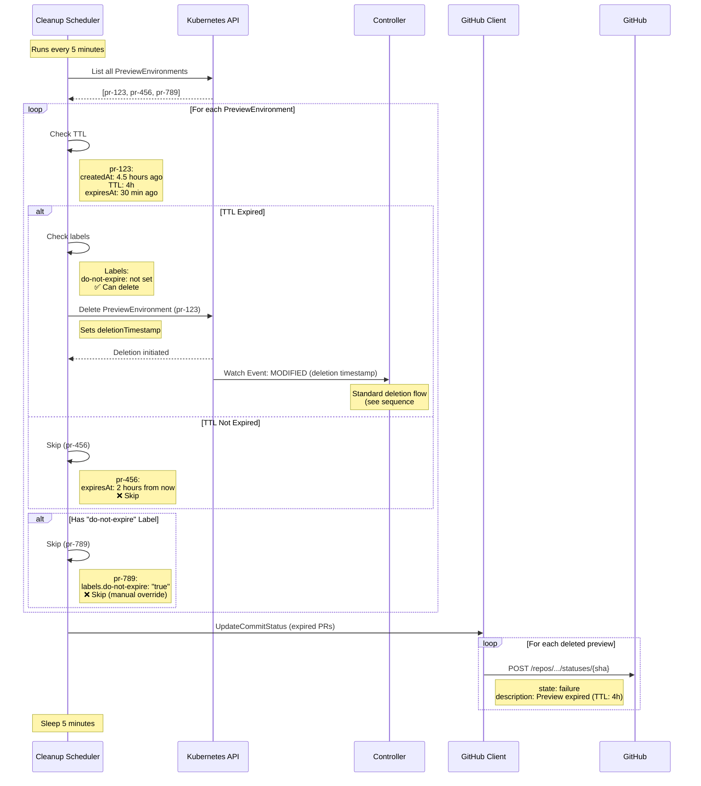

---

## 5. AI-Powered Service Detection (v0.2.0+)

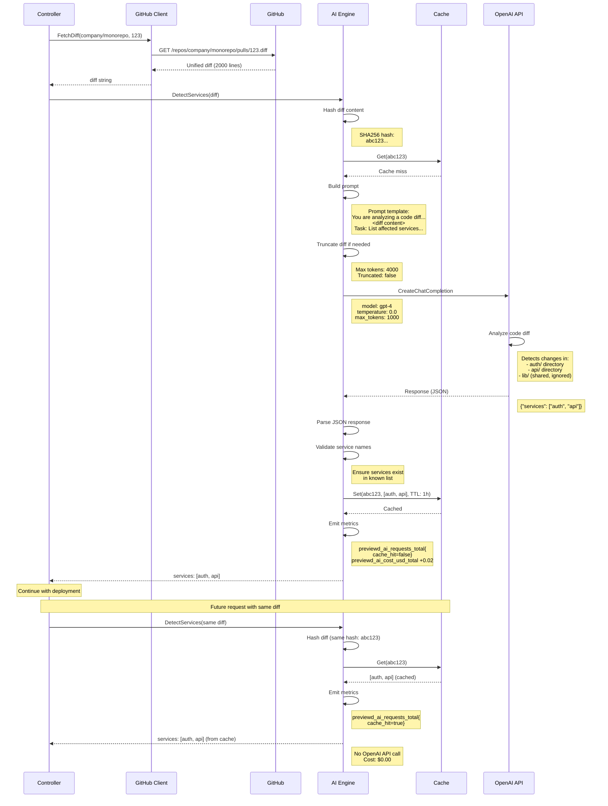

### AI Error Handling

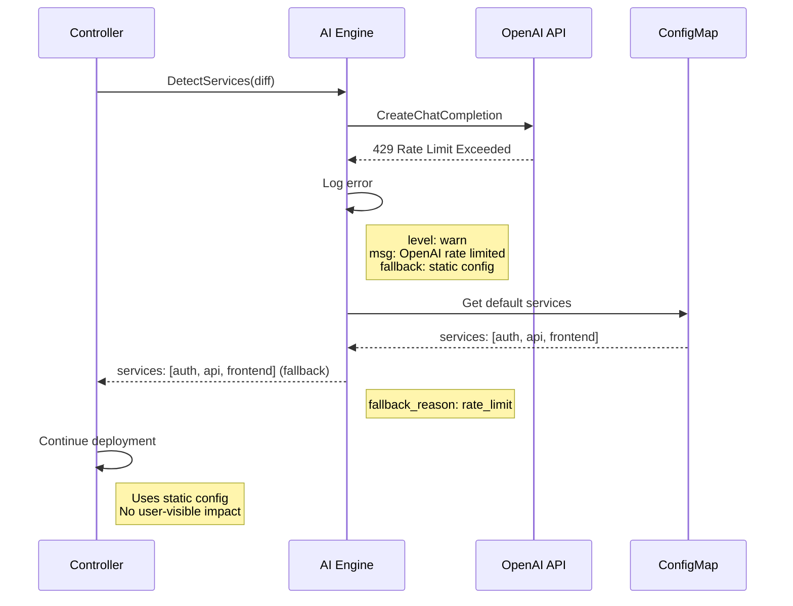

---

## 6. Multi-Service Deployment

### Parallel Service Creation

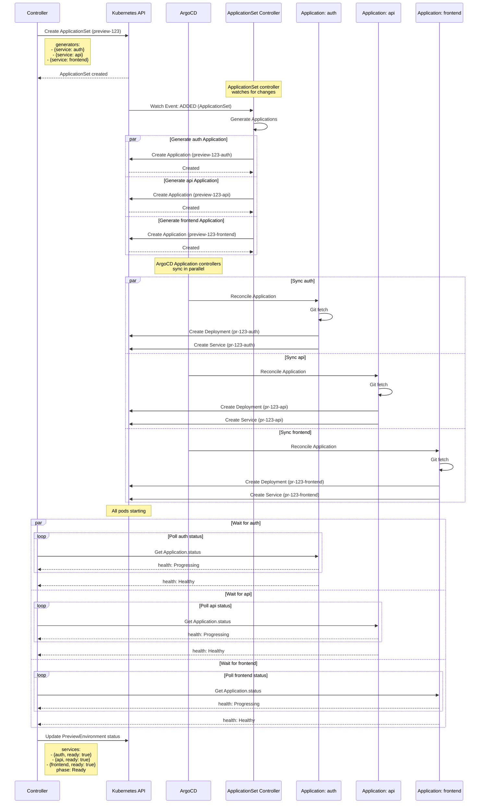

---

## 7. Failure Recovery: ArgoCD Sync Failure

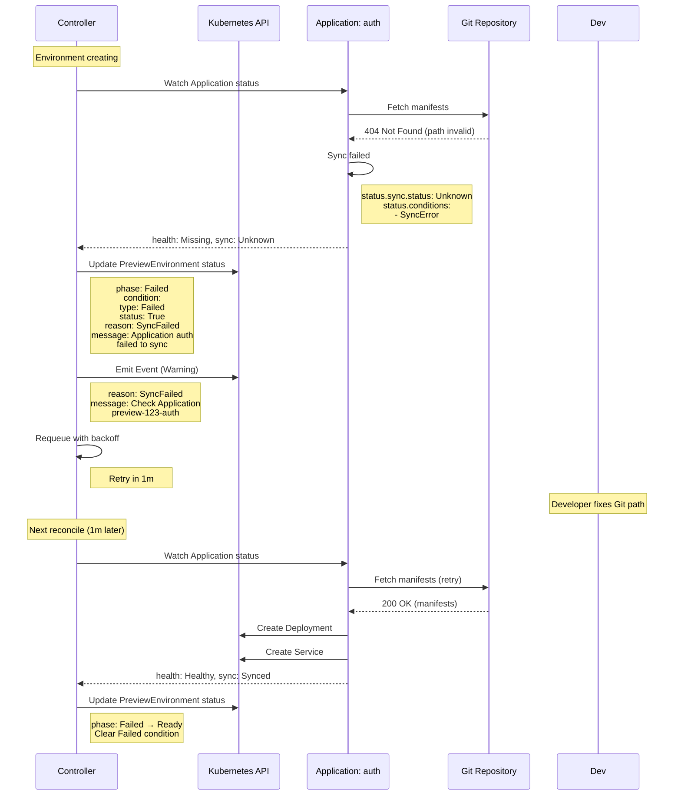

---

## 8. Cost Calculation Flow

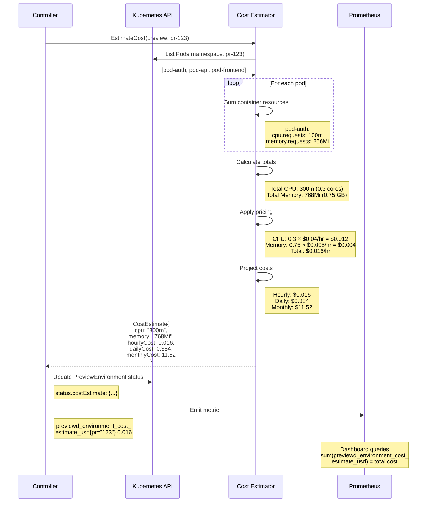

---

## 9. Leader Election (HA Setup)

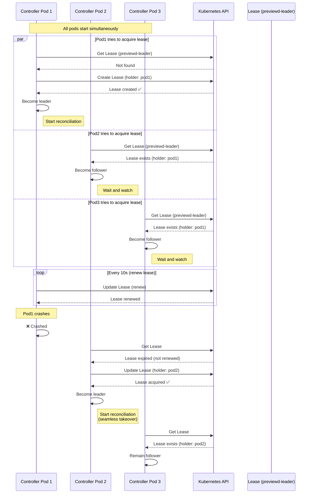

---

**Document Status**: ✅ Complete
**Last Updated**: 2025-11-09
**Authors**: Mike Lane (@mikelane)
