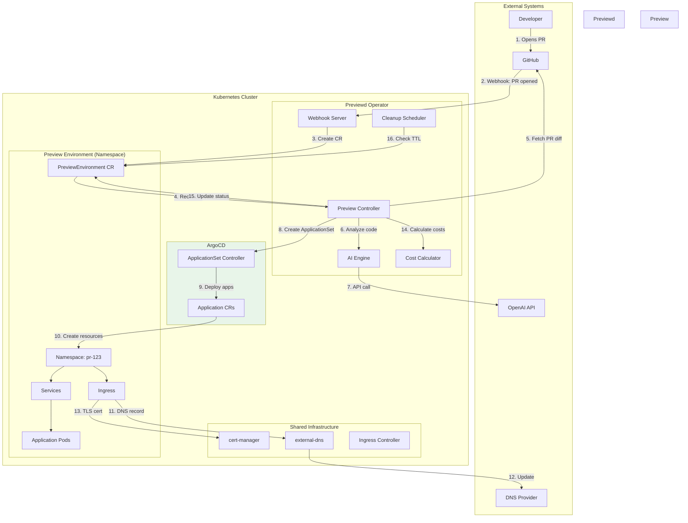
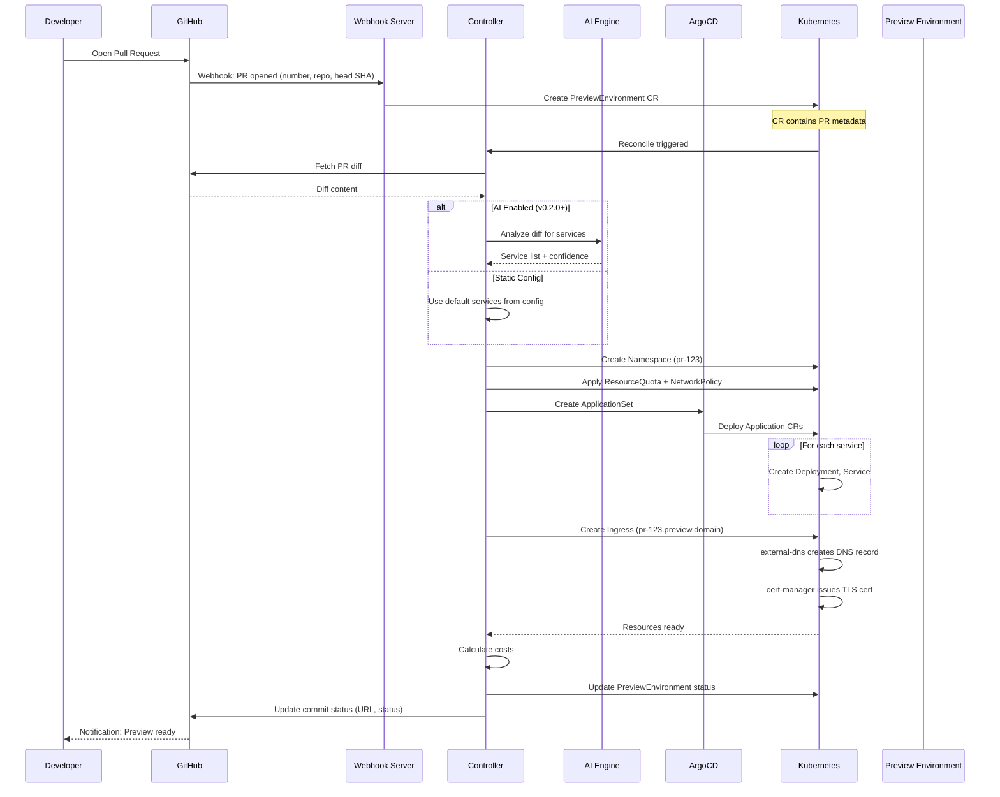
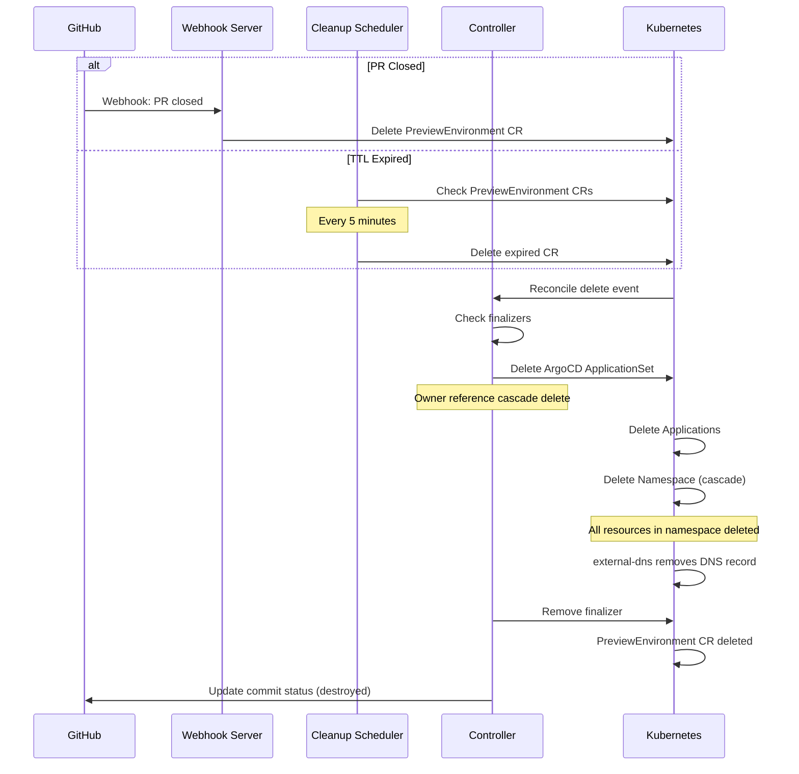

# System Architecture

## Overview

Previewd is a Kubernetes operator that automates the creation, management, and cleanup of ephemeral preview environments for pull requests. It integrates with GitHub for event notifications, ArgoCD for GitOps-based deployments, and optionally leverages AI for intelligent service detection and cost optimization.

## High-Level Architecture



## System Components

### 1. Previewd Operator

**Role**: Core operator that orchestrates preview environment lifecycle

**Components**:
- **Webhook Server**: Receives GitHub webhook events (PR opened/closed/updated)
- **Preview Controller**: Main reconciliation loop for PreviewEnvironment CRs
- **AI Engine**: Code analysis and service detection (v0.2.0+)
- **Cost Calculator**: Estimates and tracks preview environment costs
- **Cleanup Scheduler**: Enforces TTL policies and garbage collection

**Responsibilities**:
- Listen for GitHub PR events
- Create/update/delete PreviewEnvironment custom resources
- Integrate with ArgoCD for GitOps deployments
- Analyze code changes to detect affected services
- Estimate and optimize costs
- Enforce TTL-based cleanup policies
- Emit metrics and events for observability

### 2. GitHub Integration

**Role**: Source of truth for PR lifecycle and code changes

**Interactions**:
- **Webhooks → Previewd**: PR events (opened, closed, synchronized, labeled)
- **Previewd → GitHub API**: Fetch PR metadata, diff content, commit SHAs
- **Previewd → GitHub Status API**: Report preview environment status/URL

**Authentication**: Personal Access Token (PAT) or GitHub App installation token

### 3. ArgoCD Integration

**Role**: GitOps-based deployment engine

**Why ArgoCD?** (See ADR-001)
- Declarative, auditable deployments
- Native multi-tenancy support
- Automatic sync and drift detection
- Mature ecosystem with strong community

**Integration Pattern**:
- Previewd creates **ApplicationSet** resources per preview environment
- ApplicationSet generates **Application** CRs for each service
- ArgoCD syncs Applications from Git repositories
- Previewd watches Application status for readiness

### 4. DNS and TLS

**DNS**: external-dns automatically creates DNS records from Ingress annotations
- Pattern: `pr-{number}.preview.{domain}` (e.g., `pr-123.preview.company.com`)

**TLS**: cert-manager provisions certificates from Let's Encrypt
- Automatic certificate issuance via cert-manager ClusterIssuer
- HTTP-01 or DNS-01 challenge (configurable)

### 5. AI Engine (v0.2.0+)

**Role**: Intelligent code analysis and optimization

**Capabilities**:
1. **Service Detection**: Analyze PR diff → identify affected services
2. **Synthetic Data Generation**: Generate test data from schemas
3. **Cost Prediction**: Estimate environment lifespan and resource needs
4. **Test Selection**: Recommend relevant tests based on code changes

**Implementation**:
- OpenAI API (GPT-4) for code analysis
- Response caching (Redis/in-memory) to reduce costs
- Fallback to static configuration if AI unavailable
- Feature flags to enable/disable AI features

## Data Flow

### Primary Flow: PR Opened → Environment Created



### Cleanup Flow: TTL Expired or PR Closed



## Scalability Design

### Horizontal Scaling

**Operator Replicas**:
- Controller: Single leader elected instance (default)
- Webhook Server: Multiple replicas behind Service (3+)
- AI Engine: Stateless, horizontally scalable

**Preview Environments**:
- Each preview is isolated in a namespace
- Resource quotas prevent noisy neighbor issues
- Node affinity/taints for preview workloads (optional)

### Resource Optimization

**Per-Preview Limits** (configurable):
```yaml
resources:
  limits:
    cpu: "2"
    memory: 4Gi
  requests:
    cpu: "500m"
    memory: 1Gi
```

**Cluster Capacity**:
- 1000 previews × 1Gi RAM = 1TB RAM required
- Use spot instances for preview nodes (cost optimization)
- Cluster autoscaler scales nodes based on pending pods

### Rate Limiting

**GitHub Webhooks**:
- Queue incoming webhooks (channel buffer: 100)
- Process sequentially to avoid API rate limits

**ArgoCD**:
- Rate limit ApplicationSet creation (max 10/minute)
- Batch updates when possible

**AI API**:
- Rate limit: 100 requests/minute (configurable)
- Cache responses for 1 hour per diff hash

## High Availability

### Operator HA

**Controller**:
- Leader election (client-go/leaderelection)
- Single active instance, hot standbys
- Lease duration: 15s, renew deadline: 10s

**Webhook Server**:
- Stateless, run 3+ replicas
- LoadBalancer or Ingress distributes traffic
- Health checks: `/healthz`, `/readyz`

**Data Persistence**:
- State stored in Kubernetes CRs (etcd)
- No external database required
- Backup etcd regularly

### Failure Scenarios

| Failure | Impact | Recovery |
|---------|--------|----------|
| Operator pod crash | Webhooks buffered, reconcile paused | New leader elected in <30s |
| ArgoCD unavailable | Deployments paused | Retry with exponential backoff |
| GitHub API down | Webhook processing fails | Queue webhooks, retry later |
| AI API down | Falls back to static config | No user-visible impact |
| Node failure | Pods rescheduled | Kubernetes auto-recovery |

## Security Architecture

### Network Security

**Namespace Isolation**:
- NetworkPolicy: deny all ingress by default
- Allow ingress only from Ingress Controller
- Allow egress to DNS, external APIs (GitHub, OpenAI)

**TLS Everywhere**:
- Ingress: TLS termination (cert-manager)
- Webhook: TLS endpoint (GitHub validates cert)
- ArgoCD: mTLS for Application sync (optional)

### Authentication & Authorization

**RBAC Model**:
```yaml
# Operator service account
apiVersion: rbac.authorization.k8s.io/v1
kind: ClusterRole
metadata:
  name: previewd-operator
rules:
  # Core resources
  - apiGroups: [""]
    resources: [namespaces, services, configmaps, secrets]
    verbs: [get, list, watch, create, update, delete]

  # ArgoCD resources
  - apiGroups: [argoproj.io]
    resources: [applications, applicationsets]
    verbs: [get, list, watch, create, update, delete]

  # Ingress resources
  - apiGroups: [networking.k8s.io]
    resources: [ingresses]
    verbs: [get, list, watch, create, update, delete]

  # Custom resources
  - apiGroups: [preview.previewd.io]
    resources: [previewenvironments, previewenvironments/status]
    verbs: [get, list, watch, create, update, patch, delete]
```

**Secrets Management**:
- GitHub token: Kubernetes Secret (sealed-secrets or external-secrets)
- OpenAI API key: Kubernetes Secret
- Secrets mounted as environment variables (not volumes)

### Webhook Security

**GitHub Webhook Validation**:
- HMAC-SHA256 signature validation (X-Hub-Signature-256 header)
- Webhook secret stored in Kubernetes Secret
- Reject unsigned or invalid requests

**Rate Limiting**:
- Max 100 webhooks/minute per repository
- DDoS protection via Ingress controller

## Observability

### Metrics (Prometheus)

**Operator Metrics**:
```
# Preview environments
previewd_environments_total{status="active|failed|destroying"}
previewd_environment_creation_duration_seconds_bucket
previewd_environment_deletion_duration_seconds_bucket

# Reconciliation
previewd_reconcile_duration_seconds_bucket{controller="previewenvironment"}
previewd_reconcile_errors_total{controller="previewenvironment"}

# Webhooks
previewd_webhook_requests_total{event_type="pull_request",action="opened|closed"}
previewd_webhook_errors_total

# AI (v0.2.0+)
previewd_ai_requests_total{provider="openai",cache_hit="true|false"}
previewd_ai_cost_usd_total

# Costs
previewd_environment_cost_estimate_usd{pr_number="123"}
```

**ArgoCD Metrics** (existing):
- Application sync status
- Sync duration
- Sync errors

### Logging

**Structured Logging** (JSON format):
```json
{
  "level": "info",
  "ts": "2025-11-09T10:30:00Z",
  "logger": "controller.previewenvironment",
  "msg": "Preview environment created",
  "pr_number": 123,
  "namespace": "pr-123",
  "duration_seconds": 45.3,
  "services": ["auth", "api", "frontend"]
}
```

**Log Levels**:
- INFO: Lifecycle events (created, updated, deleted)
- WARN: Retryable errors, slow operations
- ERROR: Permanent failures, invalid configurations

### Tracing (OpenTelemetry)

**Spans**:
- `reconcile`: Full reconciliation cycle
- `github.fetch_diff`: GitHub API call
- `ai.analyze_code`: AI analysis
- `argocd.create_applicationset`: ArgoCD integration
- `cost.calculate`: Cost estimation

**Context Propagation**:
- Trace ID in logs for correlation
- Distributed tracing across components

### Status & Events

**PreviewEnvironment Status Conditions**:
```yaml
status:
  conditions:
    - type: Ready
      status: "True"
      reason: EnvironmentReady
      message: All services are running
    - type: Deploying
      status: "False"
      reason: DeploymentComplete
    - type: Failed
      status: "False"
      reason: NoErrors
  url: https://pr-123.preview.company.com
  services:
    - name: auth
      ready: true
    - name: api
      ready: true
  costEstimate:
    cpu: "1.5"
    memory: "3Gi"
    estimatedMonthlyCost: "$45.00"
  createdAt: "2025-11-09T10:30:00Z"
  expiresAt: "2025-11-09T14:30:00Z"  # 4 hour TTL
```

**Kubernetes Events**:
```yaml
Events:
  Type    Reason              Message
  ----    ------              -------
  Normal  PreviewCreating     Creating preview environment for PR #123
  Normal  NamespaceCreated    Created namespace pr-123
  Normal  ApplicationCreated  Created ArgoCD ApplicationSet
  Normal  PreviewReady        Preview environment ready at https://pr-123.preview.company.com
```

## Cost Optimization

### Resource Sizing

**Default Sizes** (per service):
```yaml
requests:
  cpu: 100m      # ~$3/month
  memory: 256Mi  # ~$1/month
limits:
  cpu: 500m      # Burst allowed
  memory: 512Mi  # OOMKill protection
```

**AI-Optimized Sizing** (v0.2.0+):
- Analyze historical resource usage per service
- Right-size based on PR complexity (lines changed)
- Predict lifespan (active PRs get more resources)

### Spot Instances

**Node Affinity**:
```yaml
affinity:
  nodeAffinity:
    preferredDuringSchedulingIgnoredDuringExecution:
      - weight: 100
        preference:
          matchExpressions:
            - key: node.kubernetes.io/instance-type
              operator: In
              values: [spot]
```

**Fallback**: Schedule on on-demand nodes if spot unavailable

### TTL Policies

**Default TTL**: 4 hours
**Extended TTL**: 24 hours (if PR marked "do-not-expire" label)
**Force Delete**: 7 days (absolute maximum)

**AI-Predicted TTL** (v0.2.0+):
- Estimate based on PR activity (comments, commits)
- Shorter TTL for stale PRs, longer for active ones

### Cost Tracking

**Per-Preview Cost**:
```
cost = (cpu_cores × $0.04/hour) + (memory_gb × $0.005/hour) + (storage_gb × $0.10/month)
```

**Organization-Wide**:
- Aggregate costs across all previews
- Alert if monthly budget exceeded
- Dashboard showing cost per team/repository

## Technology Stack

### Core Technologies

| Component | Technology | Version | Why? |
|-----------|-----------|---------|------|
| Language | Go | 1.25.4 | K8s ecosystem standard |
| Framework | Kubebuilder | 4.x | Official operator SDK |
| K8s Client | client-go | 0.31.x | Native Kubernetes API |
| GitOps | ArgoCD | 2.13+ | Declarative deployments |
| DNS | external-dns | 0.15+ | Automatic DNS records |
| TLS | cert-manager | 1.16+ | Automatic certificates |
| AI | OpenAI API | GPT-4 | Best code understanding |
| Metrics | Prometheus | - | K8s standard |
| Tracing | OpenTelemetry | 1.32+ | Observability standard |

### Alternative Considerations

**ArgoCD vs Flux**:
- ✅ ArgoCD: Better UI, multi-tenancy, ApplicationSet
- ❌ Flux: Simpler, lighter, but less features

**OpenAI vs Ollama**:
- v0.2.0: OpenAI (faster development, better accuracy)
- v0.3.0: Add Ollama support (on-prem deployments)

**external-dns vs Static DNS**:
- ✅ external-dns: Automatic, scales to 1000s of previews
- ❌ Static DNS: Requires manual updates, error-prone

## Deployment Topology

### Single-Cluster Deployment (Recommended)

```
┌─────────────────────────────────────────┐
│         Kubernetes Cluster              │
│                                         │
│  ┌─────────────────────────────────┐   │
│  │  System Namespace (previewd)    │   │
│  │  - Previewd Operator            │   │
│  │  - Webhook Server               │   │
│  │  - ArgoCD                       │   │
│  │  - cert-manager                 │   │
│  │  - external-dns                 │   │
│  │  - Ingress Controller           │   │
│  └─────────────────────────────────┘   │
│                                         │
│  ┌─────────────────────────────────┐   │
│  │  Preview Namespace (pr-123)     │   │
│  │  - Application Pods             │   │
│  │  - Services                     │   │
│  │  - Ingress                      │   │
│  └─────────────────────────────────┘   │
│                                         │
│  ┌─────────────────────────────────┐   │
│  │  Preview Namespace (pr-456)     │   │
│  │  ...                            │   │
│  └─────────────────────────────────┘   │
└─────────────────────────────────────────┘
```

**Pros**:
- Simple to operate
- Lower latency (same cluster)
- Lower cost (shared control plane)

**Cons**:
- Single point of failure
- Resource contention possible

### Multi-Cluster Deployment (Enterprise)

```
┌─────────────────────────┐       ┌─────────────────────────┐
│   Control Cluster       │       │   Preview Cluster       │
│                         │       │                         │
│  - Previewd Operator    │       │  - Preview Namespaces   │
│  - Webhook Server       │       │  - Application Pods     │
│  - ArgoCD Control Plane │──────>│  - Ingress Controller   │
│                         │       │                         │
└─────────────────────────┘       └─────────────────────────┘
```

**Pros**:
- Isolation (blast radius)
- Scale independently
- Multi-cloud possible

**Cons**:
- More complex
- Higher cost
- Network latency

## Phase Roadmap

### v0.1.0 - Core Operator (No AI)

**Deliverables**:
- ✅ PreviewEnvironment CRD
- ✅ Controller with reconciliation loop
- ✅ GitHub webhook integration
- ✅ ArgoCD ApplicationSet integration
- ✅ Namespace isolation with ResourceQuota
- ✅ Ingress + external-dns + cert-manager
- ✅ TTL-based cleanup
- ✅ Basic cost estimation (sum of requests)
- ✅ Prometheus metrics
- ✅ Unit + integration tests (>80% coverage)

**Architecture Focus**:
- Solid operator foundations
- Idempotent reconciliation
- Error handling and retries
- Observability built-in

### v0.2.0 - AI Integration

**Deliverables**:
- ✅ OpenAI API integration
- ✅ Code diff analysis → service detection
- ✅ Synthetic test data generation
- ✅ Cost prediction (lifespan estimation)
- ✅ Smart test selection
- ✅ Response caching (reduce costs)
- ✅ Feature flags for AI features
- ✅ A/B testing framework

**Architecture Focus**:
- AI as augmentation, not replacement
- Fallback to static config
- Cost tracking for AI API calls
- Measure impact (accuracy, time saved, cost)

### v0.3.0 - Production Polish

**Deliverables**:
- ✅ Ollama support (local LLM)
- ✅ Security hardening (audit, penetration testing)
- ✅ Performance optimization (1000s of PRs)
- ✅ Multi-cluster support
- ✅ Air-gapped deployment support
- ✅ Advanced cost optimization
- ✅ Grafana dashboards
- ✅ SLO/SLA definitions

**Architecture Focus**:
- Enterprise-ready
- Production SLOs
- Cost optimization at scale
- On-prem support

## Success Criteria

### Technical Metrics

- **Performance**: <2 minutes from PR open → preview ready
- **Reliability**: 99.9% uptime for operator
- **Scalability**: Support 1000+ concurrent previews
- **Cost**: <$0.10 per preview per hour
- **Test Coverage**: >90%

### Business Metrics

- **GitHub Stars**: 500+ in 6 months
- **Production Users**: 10 companies
- **Contributors**: 5+ external contributors
- **Speaking**: 1+ conference/meetup talks

## References

- [Kubernetes Operator Pattern](https://kubernetes.io/docs/concepts/extend-kubernetes/operator/)
- [Kubebuilder Book](https://book.kubebuilder.io/)
- [ArgoCD Documentation](https://argo-cd.readthedocs.io/)
- [external-dns](https://github.com/kubernetes-sigs/external-dns)
- [cert-manager](https://cert-manager.io/)
- [OpenTelemetry Go](https://opentelemetry.io/docs/languages/go/)

---

**Document Status**: ✅ Complete
**Last Updated**: 2025-11-09
**Authors**: Mike Lane (@mikelane)
**Reviewers**: TBD
